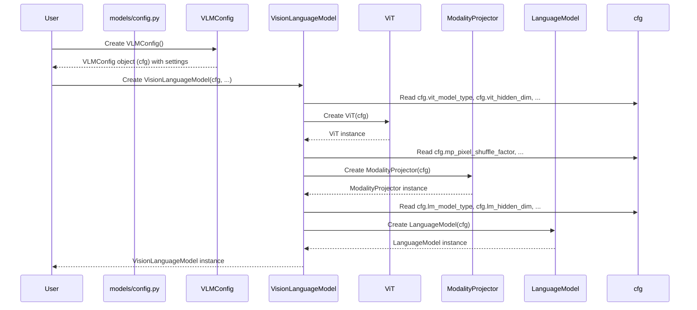

# Chapter 1: VLMConfig

Welcome to the nanoVLM tutorial! In this first chapter, we're going to look at the blueprint that defines our Vision-Language Model: the `VLMConfig`.

Imagine you're building something complex, like a custom computer or even baking a cake. You need a set of instructions or a recipe that tells you exactly what components to use and how they should fit together. In the world of building machine learning models, especially large and complex ones like Vision-Language Models (VLMs), we need something similar: a *configuration*.

The `VLMConfig` is essentially the "recipe" or "blueprint" for the entire nanoVLM model. It holds all the important settings and numbers (we call these **hyperparameters**) that determine the model's structure and size.

Why do we need this? When we want to create our `VisionLanguageModel`, we need to tell it things like:

*   How big should the image-understanding part be?
*   How many layers should the text-generating part have?
*   Where can it find the pre-trained pieces if needed?

Instead of passing dozens of individual numbers every time we create the model, we gather all these settings into one organized place: the `VLMConfig`. This makes it much cleaner and easier to manage the model's design.

Let's see how we might use this to create our `VisionLanguageModel`.

## Using VLMConfig

The most basic way to use `VLMConfig` is when you want to create a `VisionLanguageModel` from scratch or load its main components based on a specific design.

First, we need to import it:

```python
from models.config import VLMConfig
from models.vision_language_model import VisionLanguageModel
```

The `VLMConfig` is set up with some default values that work well for the base nanoVLM model. You can create an instance of the default configuration very simply:

```python
# Create a VLMConfig instance with default settings
model_config = VLMConfig()

print(model_config)
```

This `model_config` object now holds all the default hyperparameters. If you print it, you'll see a list of settings like `vit_hidden_dim=768`, `lm_n_blocks=30`, etc.

Now, when we want to create the actual `VisionLanguageModel`, we pass this configuration object to it:

```python
# Create the VisionLanguageModel using the configuration
# The load_backbone=True flag (which is the default in VLMConfig)
# tells the model to try and load pre-trained weights for its parts
model = VisionLanguageModel(model_config, load_backbone=model_config.vlm_load_backbone_weights)

# The 'model' object is now built according to the blueprint in model_config
print("Model created successfully!")
```

This is a common pattern you'll see throughout the nanoVLM code, for example in the `benchmark_vlm` function from `benchmark_suite.py`:

```python
# From benchmark_suite.py
def benchmark_vlm(...):
    # ... other code ...
    cfg = VLMConfig( # Create a custom config by overriding defaults
        vit_model_type=vit_model_type,
        lm_model_type=lm_model_type,
        lm_tokenizer=lm_tokenizer_path,
        mp_pixel_shuffle_factor=mp_pixel_shuffle_factor,
        vlm_load_backbone_weights=True
    )
    # Pass the custom config to the model
    model = VisionLanguageModel(cfg, load_backbone=True).to(device).eval()
    # ... rest of benchmark function ...
```

Here, the `benchmark_vlm` function *doesn't* use the absolute default `VLMConfig`. Instead, it creates a `VLMConfig` instance and specifically sets (or *overrides*) some values like `vit_model_type` and `mp_pixel_shuffle_factor` based on the benchmark's goal. This shows how flexible the `VLMConfig` is – you can easily tweak settings to create models with different structures or use different pre-trained components.

You can also see the config being used when loading a model that has already been trained and saved, like in `generate.py`:

```python
# From generate.py
def main():
    args = parse_args()
    # ... device setup ...

    source = args.checkpoint if args.checkpoint else args.hf_model
    print(f"Loading weights from: {source}")
    # Load model from a saved checkpoint (which includes its config)
    model = VisionLanguageModel.from_pretrained(source).to(device)
    model.eval()

    # Access settings from the loaded model's config
    tokenizer = get_tokenizer(model.cfg.lm_tokenizer)
    image_processor = get_image_processor(model.cfg.vit_img_size)
    # ... rest of generation code ...
```

When you use `VisionLanguageModel.from_pretrained()`, it automatically loads the `VLMConfig` that was saved along with the model weights. The loaded model object then has a `.cfg` attribute (`model.cfg`) that holds this configuration, allowing you to access settings like the tokenizer path or image size that the model was trained with.

In `train.py`, the config is created and then potentially modified based on command-line arguments before being passed to the model:

```python
# From train.py
def main():
    parser = argparse.ArgumentParser()
    # ... add arguments ...
    args = parser.parse_args()

    # Create default configs
    vlm_cfg = config.VLMConfig()
    train_cfg = config.TrainConfig() # We'll see TrainConfig later

    # Override config settings based on command line arguments
    if args.vlm_checkpoint_path is not None:
        vlm_cfg.vlm_checkpoint_path = args.vlm_checkpoint_path

    if args.resume_from_vlm_checkpoint and args.vlm_checkpoint_path is not None:
        train_cfg.resume_from_vlm_checkpoint = True
        # Special case: if resuming, we don't load backbones again
        vlm_cfg.vlm_load_backbone_weights = False

    print("--- VLM Config ---")
    print(vlm_cfg) # Print the final config being used
    print("--- Train Config ---")
    print(train_cfg)

    # Pass the possibly modified config to the training function
    train(train_cfg, vlm_cfg)
```

This highlights the flexibility: you define a base configuration, and then you can easily update specific values based on your needs (like where to save checkpoints or whether to load pre-trained weights).

In summary, the `VLMConfig` is used to:

1.  Define the structure and settings for the model.
2.  Pass these settings to the `VisionLanguageModel` when it's created.
3.  Store and load model settings alongside model weights.
4.  Easily modify specific hyperparameters for different experiments or use cases.

## Under the Hood: How VLMConfig Works

`VLMConfig` itself doesn't *do* anything magical. It's just a container for information. It's defined as a Python `dataclass`. Dataclasses are a simple way to create classes that are primarily used to store data. They automatically handle things like creating the `__init__` method for you.

Here's a simplified look at its definition in `models/config.py`:

```python
# From models/config.py
from dataclasses import dataclass

@dataclass # This decorator makes it a dataclass
class VLMConfig:
    # These are the attributes (settings) with their types and default values
    vit_hidden_dim: int = 768 # Hidden size for the Vision Transformer
    vit_patch_size: int = 16 # Patch size for the ViT
    vit_model_type: str = 'google/siglip-base-patch16-224' # Identifier for the ViT backbone

    lm_hidden_dim: int = 576 # Hidden size for the Language Model
    lm_n_blocks: int = 30   # Number of layers/blocks in the LM
    lm_tokenizer: str = 'HuggingFaceTB/cosmo2-tokenizer' # Identifier for the LM tokenizer

    mp_pixel_shuffle_factor: int = 2 # Setting for the Modality Projector

    vlm_load_backbone_weights: bool = True # Should the VLM load pre-trained weights?
    vlm_checkpoint_path: str = 'checkpoints/nanoVLM-222M' # Where to save/load the VLM

    # ... many more settings ...
```

As you can see, it's just a list of variable names (like `vit_hidden_dim`, `lm_n_blocks`, `mp_pixel_shuffle_factor`) with their data types (like `int`, `str`, `bool`) and default values.

When you create `VLMConfig()` with no arguments, you get an object with all these default values. When you create `VLMConfig(vit_model_type='new_model')`, it uses the default values for everything *except* `vit_model_type`, which it sets to `'new_model'`.

The real magic happens inside the `VisionLanguageModel` when you create it. Its `__init__` method takes the `VLMConfig` object as an argument (usually named `cfg`). It then reads the values from `cfg` to configure its internal components: the [Vision Transformer (ViT)](02_vision_transformer__vit__.md), the [Modality Projector (MP)](03_modality_projector__mp__.md), and the [Language Model (LM)](04_language_model__lm__.md).

Here's a simplified sequence diagram showing how this works:



And here's a snippet from the `VisionLanguageModel.__init__` method in `models/vision_language_model.py` showing it taking the config and using it:

```python
# From models/vision_language_model.py
class VisionLanguageModel(nn.Module):
    def __init__(self, cfg: VLMConfig, load_backbone=True):
        super().__init__()
        self.cfg = cfg # Store the config object

        if load_backbone:
            # Use cfg to create the Vision Encoder (ViT) and load weights
            self.vision_encoder = ViT.from_pretrained(cfg)
            # Use cfg to create the Language Model (decoder) and load weights
            self.decoder = LanguageModel.from_pretrained(cfg)
        else:
            # Use cfg to create the Vision Encoder (ViT) without loading
            self.vision_encoder = ViT(cfg)
            # Use cfg to create the Language Model (decoder) without loading
            self.decoder = LanguageModel(cfg)

        # Use cfg to create the Modality Projector
        self.MP = ModalityProjector(cfg)
        self.load_backbone = load_backbone
```

This code shows that the `VisionLanguageModel` constructor directly uses the settings from the `cfg` object to decide how to initialize its sub-modules (`self.vision_encoder`, `self.decoder`, `self.MP`). For example, the `ViT` and `LanguageModel` classes likely have their *own* `__init__` methods that also accept a config object (or read directly from the `VLMConfig` object passed down), using the relevant `vit_...` or `lm_...` settings to build themselves to the specified size and structure.

## Conclusion

In this chapter, we learned that `VLMConfig` is the central blueprint for the nanoVLM model, containing all the hyperparameters that define its architecture. We saw how to create a `VLMConfig`, how to pass it to the `VisionLanguageModel` constructor, and how the `VisionLanguageModel` uses it to build its internal components. This configuration system provides a clean and organized way to manage the complexity of a multimodal model.

Now that we understand the overall blueprint, let's start looking at the first major component defined by this config: the Vision Transformer, which handles the image understanding.

[Next Chapter: Vision Transformer (ViT)](02_vision_transformer__vit__.md)


