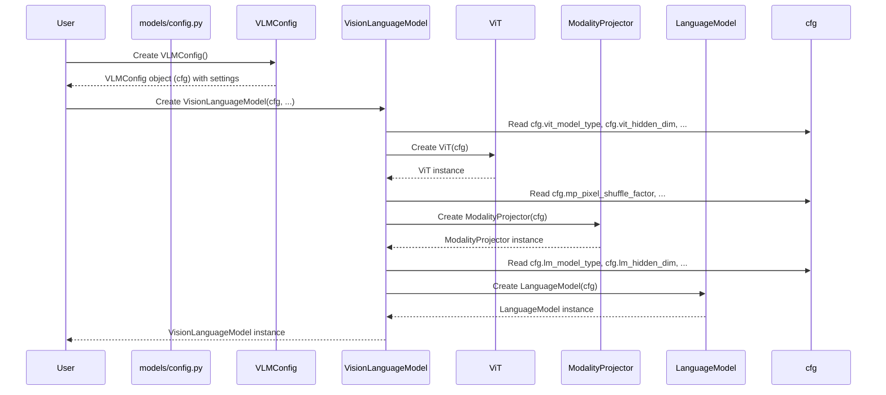

# 챕터 1: VLMConfig

nanoVLM 튜토리얼에 오신 것을 환영합니다! 이 첫 번째 챕터에서는 Vision-Language Model을 정의하는 청사진인 `VLMConfig`에 대해 살펴보겠습니다.

복잡한 것을 만드는 것을 상상해보세요. 예를 들어, 커스텀 컴퓨터를 조립하거나 케이크를 굽는 것처럼요. 이때는 사용할 부품이나 재료가 무엇인지, 그리고 어떻게 조합해야 하는지 알려주는 지침이나 레시피가 필요합니다. 머신러닝 모델, 특히 Vision-Language Models (VLMs)와 같은 크고 복잡한 모델을 구축할 때도 비슷한 것이 필요합니다: 바로 *configuration* 입니다.

`VLMConfig`는 기본적으로 전체 nanoVLM 모델의 "레시피" 또는 "청사진"입니다. 이는 모델의 구조와 크기를 결정하는 모든 중요한 설정과 숫자(이를 **hyperparameters**라고 부릅니다)를 담고 있습니다.

왜 이것이 필요할까요? `VisionLanguageModel`을 만들 때 다음과 같은 것들을 지정해야 합니다:

* 이미지 이해 부분의 크기는 얼마나 되어야 할까요?
* 텍스트 생성 부분은 몇 개의 레이어를 가져야 할까요?
* 필요한 경우 사전 학습된 부분들을 어디서 찾을 수 있을까요?

모델을 만들 때마다 수십 개의 개별 숫자들을 전달하는 대신, 우리는 이러한 모든 설정들을 한 곳에 모아둡니다: 바로 `VLMConfig`입니다. 이렇게 하면 모델의 설계를 훨씬 더 깔끔하고 쉽게 관리할 수 있습니다.

이제 `VisionLanguageModel`을 만들기 위해 이것을 어떻게 사용하는지 살펴보겠습니다.

## VLMConfig 사용하기

`VLMConfig`를 사용하는 가장 기본적인 방법은 `VisionLanguageModel`을 처음부터 만들거나 특정 설계를 기반으로 주요 컴포넌트들을 로드할 때입니다.

먼저, 이를 import 해야 합니다:

```python
from models.config import VLMConfig
from models.vision_language_model import VisionLanguageModel
```

`VLMConfig`는 기본 nanoVLM 모델에 잘 작동하는 기본값들로 설정되어 있습니다. 기본 설정으로 인스턴스를 만드는 것은 매우 간단합니다:

```python
# 기본 설정으로 VLMConfig 인스턴스 생성
model_config = VLMConfig()

print(model_config)
```

이 `model_config` 객체는 이제 모든 기본 hyperparameter들을 담고 있습니다. 이를 출력하면 `vit_hidden_dim=768`, `lm_n_blocks=30` 등과 같은 설정 목록을 볼 수 있습니다.

이제 실제 `VisionLanguageModel`을 만들 때, 이 configuration 객체를 전달합니다:

```python
# configuration을 사용하여 VisionLanguageModel 생성
# load_backbone=True 플래그(VLMConfig의 기본값)는
# 모델에게 사전 학습된 가중치를 로드하도록 지시합니다
model = VisionLanguageModel(model_config, load_backbone=model_config.vlm_load_backbone_weights)

# 'model' 객체는 이제 model_config의 청사진에 따라 구축되었습니다
print("Model created successfully!")
```

이는 `benchmark_suite.py`의 `benchmark_vlm` 함수에서 볼 수 있는 nanoVLM 코드 전체에서 흔히 볼 수 있는 패턴입니다:

```python
# From benchmark_suite.py
def benchmark_vlm(...):
    # ... 다른 코드 ...
    cfg = VLMConfig( # 기본값을 재정의하여 커스텀 config 생성
        vit_model_type=vit_model_type,
        lm_model_type=lm_model_type,
        lm_tokenizer=lm_tokenizer_path,
        mp_pixel_shuffle_factor=mp_pixel_shuffle_factor,
        vlm_load_backbone_weights=True
    )
    # 커스텀 config를 모델에 전달
    model = VisionLanguageModel(cfg, load_backbone=True).to(device).eval()
    # ... benchmark 함수의 나머지 부분 ...
```

여기서 `benchmark_vlm` 함수는 절대적인 기본 `VLMConfig`를 사용하지 않습니다. 대신, `VLMConfig` 인스턴스를 생성하고 벤치마크의 목표에 따라 `vit_model_type`과 `mp_pixel_shuffle_factor`와 같은 일부 값을 명시적으로 설정(또는 *재정의*)합니다. 이는 `VLMConfig`가 얼마나 유연한지 보여줍니다 – 설정을 쉽게 조정하여 다른 구조를 가진 모델을 만들거나 다른 사전 학습된 컴포넌트를 사용할 수 있습니다.

또한 `generate.py`에서처럼 이미 학습되고 저장된 모델을 로드할 때도 config가 사용되는 것을 볼 수 있습니다:

```python
# From generate.py
def main():
    args = parse_args()
    # ... device 설정 ...

    source = args.checkpoint if args.checkpoint else args.hf_model
    print(f"Loading weights from: {source}")
    # 저장된 체크포인트에서 모델 로드 (config 포함)
    model = VisionLanguageModel.from_pretrained(source).to(device)
    model.eval()

    # 로드된 모델의 config에서 설정에 접근
    tokenizer = get_tokenizer(model.cfg.lm_tokenizer)
    image_processor = get_image_processor(model.cfg.vit_img_size)
    # ... 생성 코드의 나머지 부분 ...
```

`VisionLanguageModel.from_pretrained()`를 사용할 때, 모델 가중치와 함께 저장된 `VLMConfig`를 자동으로 로드합니다. 로드된 모델 객체는 이 configuration을 담고 있는 `.cfg` 속성(`model.cfg`)을 가지게 되어, 모델이 학습된 토크나이저 경로나 이미지 크기와 같은 설정에 접근할 수 있습니다.

`train.py`에서는 config가 생성된 후 명령줄 인수에 따라 수정될 수 있으며, 그 다음 모델에 전달됩니다:

```python
# From train.py
def main():
    parser = argparse.ArgumentParser()
    # ... 인수 추가 ...
    args = parser.parse_args()

    # 기본 config 생성
    vlm_cfg = config.VLMConfig()
    train_cfg = config.TrainConfig() # TrainConfig는 나중에 살펴보겠습니다

    # 명령줄 인수에 따라 config 설정 재정의
    if args.vlm_checkpoint_path is not None:
        vlm_cfg.vlm_checkpoint_path = args.vlm_checkpoint_path

    if args.resume_from_vlm_checkpoint and args.vlm_checkpoint_path is not None:
        train_cfg.resume_from_vlm_checkpoint = True
        # 특별한 경우: 재개할 때는 백본을 다시 로드하지 않음
        vlm_cfg.vlm_load_backbone_weights = False

    print("--- VLM Config ---")
    print(vlm_cfg) # 사용되는 최종 config 출력
    print("--- Train Config ---")
    print(train_cfg)

    # 수정될 수 있는 config를 학습 함수에 전달
    train(train_cfg, vlm_cfg)
```

이는 유연성을 강조합니다: 기본 configuration을 정의한 다음, 체크포인트를 저장할 위치나 사전 학습된 가중치를 로드할지 여부와 같은 특정 값을 쉽게 업데이트할 수 있습니다.

요약하면, `VLMConfig`는 다음과 같은 용도로 사용됩니다:

1. 모델의 구조와 설정을 정의합니다.
2. `VisionLanguageModel`이 생성될 때 이러한 설정을 전달합니다.
3. 모델 가중치와 함께 모델 설정을 저장하고 로드합니다.
4. 다른 실험이나 사용 사례를 위해 특정 hyperparameter를 쉽게 수정할 수 있습니다.

## 내부 작동 방식: VLMConfig가 어떻게 작동하는가

`VLMConfig` 자체는 마법 같은 일을 하지 않습니다. 이는 단지 정보를 담는 컨테이너일 뿐입니다. 이는 Python `dataclass`로 정의되어 있습니다. Dataclass는 주로 데이터를 저장하는 데 사용되는 클래스를 만드는 간단한 방법입니다. 이는 `__init__` 메서드를 자동으로 처리하는 것과 같은 작업을 수행합니다.

`models/config.py`에서의 정의를 간단히 살펴보겠습니다:

```python
# From models/config.py
from dataclasses import dataclass

@dataclass # 이 데코레이터가 이를 dataclass로 만듭니다
class VLMConfig:
    # 이들은 타입과 기본값이 있는 속성(설정)들입니다
    vit_hidden_dim: int = 768 # Vision Transformer의 hidden size
    vit_patch_size: int = 16 # ViT의 patch size
    vit_model_type: str = 'google/siglip-base-patch16-224' # ViT 백본의 식별자

    lm_hidden_dim: int = 576 # Language Model의 hidden size
    lm_n_blocks: int = 30   # LM의 레이어/블록 수
    lm_tokenizer: str = 'HuggingFaceTB/cosmo2-tokenizer' # LM 토크나이저의 식별자

    mp_pixel_shuffle_factor: int = 2 # Modality Projector의 설정

    vlm_load_backbone_weights: bool = True # VLM이 사전 학습된 가중치를 로드해야 할까요?
    vlm_checkpoint_path: str = 'checkpoints/nanoVLM-222M' # VLM을 저장/로드할 위치

    # ... 더 많은 설정들 ...
```

보시다시피, 이는 단지 `vit_hidden_dim`, `lm_n_blocks`, `mp_pixel_shuffle_factor`와 같은 변수 이름과 그들의 데이터 타입(`int`, `str`, `bool` 등) 및 기본값의 목록입니다.

인수 없이 `VLMConfig()`를 생성하면, 모든 기본값을 가진 객체를 얻습니다. `VLMConfig(vit_model_type='new_model')`을 생성하면, `vit_model_type`을 제외한 모든 것에 대해 기본값을 사용하고, `vit_model_type`은 `'new_model'`로 설정합니다.

실제 마법은 `VisionLanguageModel`을 생성할 때 내부에서 일어납니다. 그 `__init__` 메서드는 `VLMConfig` 객체를 인수로 받습니다(보통 `cfg`라고 이름 붙입니다). 그런 다음 `cfg`에서 값을 읽어 내부 컴포넌트들을 구성합니다: [Vision Transformer (ViT)](02_vision_transformer__vit__.md), [Modality Projector (MP)](03_modality_projector__mp__.md), 그리고 [Language Model (LM)](04_language_model__lm__.md).

이것이 어떻게 작동하는지 보여주는 간단한 시퀀스 다이어그램입니다:



그리고 `models/vision_language_model.py`의 `VisionLanguageModel.__init__` 메서드에서 config를 받아 사용하는 것을 보여주는 코드 조각입니다:

```python
# From models/vision_language_model.py
class VisionLanguageModel(nn.Module):
    def __init__(self, cfg: VLMConfig, load_backbone=True):
        super().__init__()
        self.cfg = cfg # config 객체 저장

        if load_backbone:
            # cfg를 사용하여 Vision Encoder (ViT) 생성 및 가중치 로드
            self.vision_encoder = ViT.from_pretrained(cfg)
            # cfg를 사용하여 Language Model (decoder) 생성 및 가중치 로드
            self.decoder = LanguageModel.from_pretrained(cfg)
        else:
            # cfg를 사용하여 Vision Encoder (ViT) 생성 (로드 없음)
            self.vision_encoder = ViT(cfg)
            # cfg를 사용하여 Language Model (decoder) 생성 (로드 없음)
            self.decoder = LanguageModel(cfg)

        # cfg를 사용하여 Modality Projector 생성
        self.MP = ModalityProjector(cfg)
        self.load_backbone = load_backbone
```

이 코드는 `VisionLanguageModel` 생성자가 `cfg` 객체의 설정을 직접 사용하여 하위 모듈들(`self.vision_encoder`, `self.decoder`, `self.MP`)을 초기화하는 방법을 결정하는 것을 보여줍니다. 예를 들어, `ViT`와 `LanguageModel` 클래스는 아마도 자신만의 `__init__` 메서드를 가지고 있을 것이며, 이 메서드들도 config 객체를 받거나(또는 전달된 `VLMConfig` 객체에서 직접 읽어서) 관련된 `vit_...` 또는 `lm_...` 설정을 사용하여 지정된 크기와 구조로 자신을 구축할 것입니다.

## 결론

이 챕터에서 우리는 `VLMConfig`가 nanoVLM 모델의 중앙 청사진이며, 그 아키텍처를 정의하는 모든 hyperparameter를 포함하고 있다는 것을 배웠습니다. 우리는 `VLMConfig`를 만드는 방법, 이를 `VisionLanguageModel` 생성자에 전달하는 방법, 그리고 `VisionLanguageModel`이 이를 사용하여 내부 컴포넌트들을 구축하는 방법을 보았습니다. 이 configuration 시스템은 멀티모달 모델의 복잡성을 관리하는 깔끔하고 체계적인 방법을 제공합니다.

이제 전체 청사진을 이해했으니, 이 config에 의해 정의된 첫 번째 주요 컴포넌트인 이미지 이해를 처리하는 Vision Transformer를 살펴보기 시작해 보겠습니다.

[다음 챕터: Vision Transformer (ViT)](02_vision_transformer__vit__.md) 