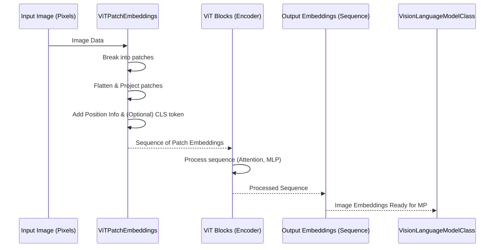

# Chapter 2: Vision Transformer (ViT)

Welcome back to the nanoVLM tutorial! In our previous chapter, we explored the [VLMConfig](01_vlmconfig_.md), which serves as the central blueprint for our Vision-Language Model. It holds all the important settings that define the model's overall structure, including details about its individual components.

Now, let's zoom in on the first major component defined by that blueprint: the Vision Transformer, or **ViT**.

## The "Eyes" of the VLM: Why We Need a ViT

Imagine you're trying to describe a picture to someone who can only understand text. You need to look at the picture, understand what's in it (objects, colors, actions, scene), and then translate that visual understanding into words.

A Vision-Language Model (VLM) like nanoVLM needs to do something similar. It takes an image and some text (like a question about the image) and needs to generate more text (like an answer). The first crucial step is for the model to "look" at the image and make sense of it. This is the job of the **Vision Transformer (ViT)**.

Think of the ViT as the VLM's **eyes**. Its core task is to process the input image and extract meaningful information from it, converting it into a format that the rest of the model, particularly the language part, can understand.

The challenge is that standard text models work with sequences of words (tokens). An image is a grid of pixels. How do you turn a grid of pixels into a sequence like text?

## Treating Images Like Sentences: The ViT Idea

The brilliant insight of the Vision Transformer was to adapt the incredibly successful Transformer architecture, which was originally designed for text, to handle images. How? By treating the image *as if it were a sentence*.

Here's the basic idea:

1.  **Break the Image into Pieces:** Just like a sentence is made of words, an image is broken down into small, equal-sized squares called **patches**.
2.  **Flatten the Pieces:** Each patch is then "flattened" and turned into a sequence of numbers.
3.  **Treat as Tokens:** These numerical representations of the patches are treated just like word tokens in a sentence.
4.  **Add Positioning:** Since Transformers process sequences without an inherent sense of order, you need to tell the model where each patch came from in the original image. This is done by adding **position information** to the numerical representation of each patch.
5.  **Process with Transformers:** The sequence of patch representations (with position information) is then fed into a standard Transformer encoder, similar to those used for processing text.

This allows the powerful attention mechanisms of the Transformer to look at different parts of the image (patches) and figure out how they relate to each other, just like it looks at different words in a sentence to understand context.

## How nanoVLM Uses the ViT

In nanoVLM, the `VisionTransformer` class (`ViT` in the code) is responsible for this image-to-sequence conversion.

As we saw in Chapter 1, the [VisionLanguageModel (VLM)](05_visionlanguagemodel__vlm__.md) is built using a [VLMConfig](01_vlmconfig_.md). Inside the `VisionLanguageModel`, the ViT is created as a sub-module, often named `vision_encoder`.

When you provide an image to the `VisionLanguageModel` (for example, during the `forward` pass or `generate` method), the image first goes through this `vision_encoder` (the ViT).

```python
# Simplified forward pass from VisionLanguageModel
def forward(self, input_ids, image, attention_mask=None, targets=None):
    # Image first goes into the ViT
    image_embd = self.vision_encoder(image) 
    # ... rest of the process ...
    return logits, loss
```

The `self.vision_encoder(image)` call is where the magic happens. The ViT takes the image data (a tensor of pixels) and outputs a sequence of numerical vectors (embeddings). Each vector in the sequence represents the processed information from a part of the image.

## Under the Hood: How the ViT Works

Let's peel back the layers and see what happens inside the `ViT` when it processes an image.

Here's a simplified step-by-step walk-through:



The input image goes through the following main stages within the `ViT`:

1.  **Patching and Embedding:** The image is divided into fixed-size patches (e.g., 16x16 pixels). A special layer (often a convolutional layer) converts each patch into a flat vector (an embedding).
2.  **Position Embedding:** Information about the original position of each patch is added to its embedding. This is crucial because the core Transformer blocks don't inherently know the spatial layout of the image. An optional "CLS" (classification) token embedding might also be added at the beginning of the sequence, often used to represent the entire image.
3.  **Transformer Encoder:** The sequence of patch embeddings (plus position info and CLS token if used) is passed through a series of standard Transformer encoder blocks. Each block contains a Multi-Head Self-Attention layer and a Feed-Forward Network (MLP), with layer normalization and residual connections. These blocks allow the model to learn relationships between different patches in the image.
4.  **Output:** After passing through all the Transformer blocks, the ViT outputs a sequence of processed embeddings. If a CLS token was used, the embedding corresponding to this token is often taken as a summary representation of the entire image. Otherwise, the sequence of patch embeddings is returned. This output sequence is then ready to be passed to the next part of the VLM.

Let's look at snippets from the `models/vision_transformer.py` file to see how this translates into code.

### Patching and Embedding (`ViTPatchEmbeddings`)

This class takes the image and performs the first step: turning patches into a sequence of embeddings.

```python
# From models/vision_transformer.py
class ViTPatchEmbeddings(nn.Module):
    def __init__(self, cfg):
        super().__init__()
        # ... config reading ...

        # This Conv layer extracts the patches and projects them
        self.conv = nn.Conv2d(
            in_channels=3, # Color image (RGB)
            out_channels=self.embd_dim, # Output size for each patch embedding
            kernel_size=self.patch_size, # Size of the patches
            stride=self.patch_size,      # How far to move for the next patch
            padding="valid",
        )

        # Position embeddings tell the model where patches are
        self.position_embedding = nn.Parameter(torch.rand(1, self.num_patches + cfg.vit_cls_flag, self.embd_dim))
        # Optional CLS token
        if cfg.vit_cls_flag:
            self.cls_token = nn.Parameter(torch.zeros(1, 1, self.embd_dim))

    def forward(self, x):
        x = self.conv(x)  # Apply convolution (extracts and embeds patches)
        x = x.flatten(2)  # Flatten spatial dimensions into one
        x = x.transpose(1, 2) # Move embedding dimension to the end (B, num_patches, emb_dim)

        # Add CLS token and position embeddings
        if self.cls_flag:
            cls_token = self.cls_token.expand(x.shape[0], -1, -1)
            x = torch.cat((cls_token, x), dim=1)
        x = x + self.position_embedding # Add positional information

        return x
```

This code snippet shows the `conv` layer which cleverly acts like both the patch extractor and the initial embedding step. It then flattens the result and adds the `position_embedding`.

### Transformer Blocks (`ViTBlock`)

The core of the Transformer is its repeating block structure. A `ViTBlock` consists of a Multi-Head Attention layer and an MLP (Feed-Forward) layer, each preceded by Layer Normalization and using residual connections.

```python
# From models/vision_transformer.py
class ViTBlock(nn.Module):
    def __init__(self, cfg):
        super().__init__()
        self.ln1 = nn.LayerNorm(cfg.vit_hidden_dim, eps=cfg.vit_ln_eps) # First Layer Norm
        self.attn = ViTMultiHeadAttention(cfg)                      # Multi-Head Attention
        self.ln2 = nn.LayerNorm(cfg.vit_hidden_dim, eps=cfg.vit_ln_eps) # Second Layer Norm
        self.mlp = ViTMLP(cfg)                                      # Feed-Forward Network (MLP)

    def forward(self, x):
        # Apply attention with residual connection
        x = x + self.attn(self.ln1(x))
        # Apply MLP with residual connection
        x = x + self.mlp(self.ln2(x))
        return x
```

This `ViTBlock` is a standard building block found in many Transformer models. The `self.attn` module calculates how much each patch should "pay attention" to other patches, and `self.mlp` processes the result independently for each patch embedding.

### Putting it Together (`ViT`)

The main `ViT` class combines the patch embeddings and the blocks.

```python
# From models/vision_transformer.py
class ViT(nn.Module):
    def __init__(self, cfg):
        super().__init__()
        self.cfg = cfg
        # Step 1: Create patch embeddings module
        self.patch_embedding = ViTPatchEmbeddings(cfg)
        # Step 2: Create a list of Transformer blocks
        self.blocks = nn.ModuleList([ViTBlock(cfg) for _ in range(cfg.vit_n_blocks)])
        # Final Layer Norm
        self.layer_norm = nn.LayerNorm(cfg.vit_hidden_dim, eps=cfg.vit_ln_eps)

        # ... weight initialization ...

    def forward(self, x):
        x = self.patch_embedding(x) # Pass through patch embeddings
        # Optional dropout
        x = self.dropout(x)

        # Pass through all transformer blocks sequentially
        for block in self.blocks:
            x = block(x)

        # Apply final Layer Norm
        if self.cfg.vit_cls_flag:
            # If using CLS token, take only its embedding
            x = self.layer_norm(x[:, 0])
        else:
            # Otherwise, normalize the sequence
            x = self.layer_norm(x)
            # Depending on the architecture, you might average or pool here
            # nanoVLM currently uses the sequence if no CLS token

        return x # Returns the sequence of image embeddings
```

The `ViT`'s `forward` method shows the flow: image in, through patch embeddings, through the sequence of blocks, finally layer normalized, and then the processed sequence (or CLS token embedding) comes out.

Notice the `ViT.from_pretrained(cfg)` class method in `models/vision_transformer.py`. This is used by the [VisionLanguageModel (VLM)](05_visionlanguagemodel__vlm__.md) to load pre-trained weights for the ViT backbone, as specified by `cfg.vit_model_type`. This is a common and important practice in deep learning: starting with a model already trained on a large dataset (like ImageNet) gives it a good initial understanding of images, which greatly helps subsequent training on the VLM task.

## Conclusion

In this chapter, we've learned that the Vision Transformer (ViT) is the crucial component that allows nanoVLM to "see". It works by breaking images into patches, treating these patches like tokens in a sentence, adding position information, and then using standard Transformer blocks to process this sequence and extract meaningful visual features. The output of the ViT is a sequence of numerical embeddings representing the image, which is essential for the next part of the VLM to integrate visual information with text.

However, these image embeddings are generated by a vision-specific model (the ViT) and need to be connected or "projected" into a space that the language model can understand. This is the job of the next component we'll explore: the Modality Projector.

[Next Chapter: Modality Projector (MP)](03_modality_projector__mp__.md)


