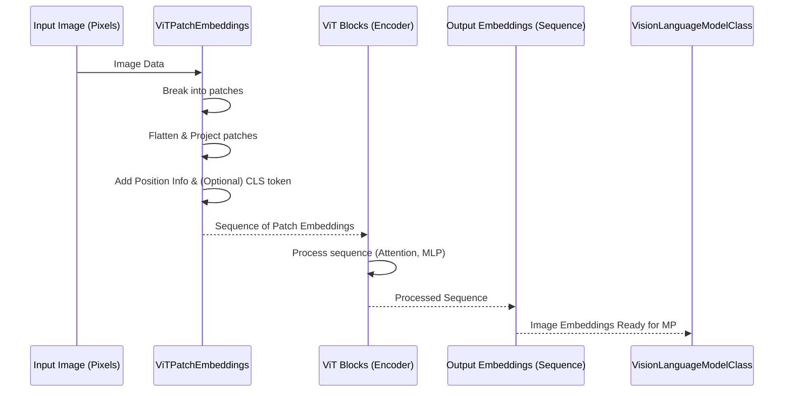

# 챕터 2: Vision Transformer (ViT)

nanoVLM 튜토리얼에 다시 오신 것을 환영합니다! 이전 챕터에서 우리는 Vision-Language Model의 중앙 청사진 역할을 하는 [VLMConfig](01_vlmconfig_.md)를 살펴보았습니다. 이는 모델의 전체 구조를 정의하는 모든 중요한 설정을 담고 있으며, 개별 컴포넌트에 대한 세부 사항도 포함하고 있습니다.

이제, 그 청사진에 의해 정의된 첫 번째 주요 컴포넌트인 Vision Transformer, 즉 **ViT**에 대해 자세히 살펴보겠습니다.

## VLM의 "눈": 왜 ViT가 필요한가

텍스트만 이해할 수 있는 사람에게 그림을 설명하려고 한다고 상상해보세요. 그림을 보고 그 안에 무엇이 있는지(물체, 색상, 동작, 장면) 이해한 다음, 그 시각적 이해를 단어로 번역해야 합니다.

nanoVLM과 같은 Vision-Language Model (VLM)도 비슷한 일을 해야 합니다. 이미지와 텍스트(이미지에 대한 질문과 같은)를 입력으로 받아 더 많은 텍스트(답변과 같은)를 생성해야 합니다. 첫 번째 중요한 단계는 모델이 이미지를 "보고" 이해하는 것입니다. 이것이 **Vision Transformer (ViT)**의 역할입니다.

ViT를 VLM의 **눈**이라고 생각하세요. 그 핵심 작업은 입력 이미지를 처리하고 의미 있는 정보를 추출하여, 특히 언어 부분을 포함한 모델의 나머지 부분이 이해할 수 있는 형식으로 변환하는 것입니다.

도전 과제는 표준 텍스트 모델이 단어(토큰)의 시퀀스로 작동한다는 것입니다. 이미지는 픽셀의 그리드입니다. 픽셀의 그리드를 텍스트와 같은 시퀀스로 어떻게 변환할까요?

## 이미지를 문장처럼 다루기: ViT 아이디어

Vision Transformer의 혁신적인 통찰은 원래 텍스트를 위해 설계된 매우 성공적인 Transformer 아키텍처를 이미지를 처리하도록 적응시키는 것이었습니다. 어떻게? 이미지를 *문장처럼 취급함으로써* 말입니다.

기본 아이디어는 다음과 같습니다:

1. **이미지를 조각으로 나누기:** 문장이 단어로 구성되듯이, 이미지는 **patches**라고 불리는 작고 동일한 크기의 정사각형으로 나뉩니다.
2. **조각을 평탄화하기:** 각 patch는 "평탄화"되어 숫자의 시퀀스로 변환됩니다.
3. **토큰으로 취급하기:** patch의 이러한 수치적 표현은 문장의 단어 토큰처럼 취급됩니다.
4. **위치 정보 추가하기:** Transformer는 본질적인 순서 감각 없이 시퀀스를 처리하기 때문에, 각 patch가 원본 이미지의 어디에서 왔는지 모델에게 알려줄 필요가 있습니다. 이는 각 patch의 수치적 표현에 **position information**을 추가함으로써 수행됩니다.
5. **Transformer로 처리하기:** patch 표현의 시퀀스(위치 정보 포함)는 텍스트 처리에 사용되는 것과 유사한 표준 Transformer encoder에 입력됩니다.

이를 통해 Transformer의 강력한 attention 메커니즘이 문장에서 다른 단어들을 보고 맥락을 이해하는 것처럼, 이미지의 다른 부분(patch)들을 보고 그것들이 서로 어떻게 관련되어 있는지 파악할 수 있습니다.

## nanoVLM이 ViT를 사용하는 방법

nanoVLM에서 `VisionTransformer` 클래스(코드에서는 `ViT`)는 이 이미지-시퀀스 변환을 담당합니다.

1장에서 보았듯이, [VisionLanguageModel (VLM)](05_visionlanguagemodel__vlm__.md)은 [VLMConfig](01_vlmconfig_.md)를 사용하여 구축됩니다. `VisionLanguageModel` 내부에서 ViT는 하위 모듈로 생성되며, 보통 `vision_encoder`라고 이름 붙여집니다.

`VisionLanguageModel`에 이미지를 제공할 때(예를 들어, `forward` 패스나 `generate` 메서드 중에), 이미지는 먼저 이 `vision_encoder`(ViT)를 통과합니다.

```python
# VisionLanguageModel의 단순화된 forward 패스
def forward(self, input_ids, image, attention_mask=None, targets=None):
    # 이미지는 먼저 ViT로 들어갑니다
    image_embd = self.vision_encoder(image) 
    # ... 나머지 처리 과정 ...
    return logits, loss
```

`self.vision_encoder(image)` 호출이 마법이 일어나는 곳입니다. ViT는 이미지 데이터(픽셀의 텐서)를 받아 수치적 벡터(embeddings)의 시퀀스를 출력합니다. 시퀀스의 각 벡터는 이미지의 한 부분에서 처리된 정보를 나타냅니다.

## 내부 작동 방식: ViT가 어떻게 작동하는가

레이어를 하나씩 벗겨내고 ViT가 이미지를 처리할 때 내부에서 무슨 일이 일어나는지 살펴보겠습니다.

다음은 단순화된 단계별 설명입니다:



입력 이미지는 `ViT` 내에서 다음과 같은 주요 단계를 거칩니다:

1. **Patching and Embedding:** 이미지는 고정 크기의 patch(예: 16x16 픽셀)로 나뉩니다. 특별한 레이어(보통 컨볼루션 레이어)가 각 patch를 평탄 벡터(embedding)로 변환합니다.
2. **Position Embedding:** 각 patch의 원래 위치에 대한 정보가 그 embedding에 추가됩니다. 이는 핵심 Transformer 블록이 본질적으로 이미지의 공간적 레이아웃을 알지 못하기 때문에 중요합니다. 선택적으로 "CLS"(classification) 토큰 embedding이 시퀀스의 시작 부분에 추가될 수 있으며, 이는 종종 전체 이미지를 나타내는 데 사용됩니다.
3. **Transformer Encoder:** patch embedding의 시퀀스(위치 정보와 CLS 토큰이 사용된 경우 포함)는 일련의 표준 Transformer encoder 블록을 통과합니다. 각 블록은 Multi-Head Self-Attention 레이어와 Feed-Forward Network (MLP)를 포함하며, layer normalization과 residual connection을 사용합니다. 이 블록들은 모델이 이미지의 서로 다른 patch들 간의 관계를 학습할 수 있게 합니다.
4. **Output:** 모든 Transformer 블록을 통과한 후, ViT는 처리된 embedding의 시퀀스를 출력합니다. CLS 토큰이 사용되었다면, 이 토큰에 해당하는 embedding이 종종 전체 이미지의 요약 표현으로 사용됩니다. 그렇지 않으면 patch embedding의 시퀀스가 반환됩니다. 이 출력 시퀀스는 VLM의 다음 부분으로 전달될 준비가 됩니다.

`models/vision_transformer.py` 파일의 코드 조각을 살펴보면서 이것이 코드로 어떻게 변환되는지 보겠습니다.

### Patching and Embedding (`ViTPatchEmbeddings`)

이 클래스는 이미지를 받아 첫 번째 단계를 수행합니다: patch를 embedding의 시퀀스로 변환합니다.

```python
# From models/vision_transformer.py
class ViTPatchEmbeddings(nn.Module):
    def __init__(self, cfg):
        super().__init__()
        # ... config 읽기 ...

        # 이 Conv 레이어는 patch를 추출하고 투영합니다
        self.conv = nn.Conv2d(
            in_channels=3, # 컬러 이미지 (RGB)
            out_channels=self.embd_dim, # 각 patch embedding의 출력 크기
            kernel_size=self.patch_size, # patch의 크기
            stride=self.patch_size,      # 다음 patch로 얼마나 이동할지
            padding="valid",
        )

        # Position embeddings는 모델에게 patch가 어디에 있는지 알려줍니다
        self.position_embedding = nn.Parameter(torch.rand(1, self.num_patches + cfg.vit_cls_flag, self.embd_dim))
        # 선택적 CLS 토큰
        if cfg.vit_cls_flag:
            self.cls_token = nn.Parameter(torch.zeros(1, 1, self.embd_dim))

    def forward(self, x):
        x = self.conv(x)  # 컨볼루션 적용 (patch 추출 및 embedding)
        x = x.flatten(2)  # 공간 차원을 하나로 평탄화
        x = x.transpose(1, 2) # embedding 차원을 끝으로 이동 (B, num_patches, emb_dim)

        # CLS 토큰과 position embeddings 추가
        if self.cls_flag:
            cls_token = self.cls_token.expand(x.shape[0], -1, -1)
            x = torch.cat((cls_token, x), dim=1)
        x = x + self.position_embedding # 위치 정보 추가

        return x
```

이 코드 조각은 `conv` 레이어를 보여주는데, 이는 교묘하게 patch 추출기와 초기 embedding 단계 모두의 역할을 합니다. 그런 다음 결과를 평탄화하고 `position_embedding`을 추가합니다.

### Transformer Blocks (`ViTBlock`)

Transformer의 핵심은 반복되는 블록 구조입니다. `ViTBlock`은 Multi-Head Attention 레이어와 MLP(Feed-Forward) 레이어로 구성되며, 각각 Layer Normalization이 선행되고 residual connection을 사용합니다.

```python
# From models/vision_transformer.py
class ViTBlock(nn.Module):
    def __init__(self, cfg):
        super().__init__()
        self.ln1 = nn.LayerNorm(cfg.vit_hidden_dim, eps=cfg.vit_ln_eps) # 첫 번째 Layer Norm
        self.attn = ViTMultiHeadAttention(cfg)                      # Multi-Head Attention
        self.ln2 = nn.LayerNorm(cfg.vit_hidden_dim, eps=cfg.vit_ln_eps) # 두 번째 Layer Norm
        self.mlp = ViTMLP(cfg)                                      # Feed-Forward Network (MLP)

    def forward(self, x):
        # residual connection과 함께 attention 적용
        x = x + self.attn(self.ln1(x))
        # residual connection과 함께 MLP 적용
        x = x + self.mlp(self.ln2(x))
        return x
```

이 `ViTBlock`은 많은 Transformer 모델에서 볼 수 있는 표준 빌딩 블록입니다. `self.attn` 모듈은 각 patch가 다른 patch들에 얼마나 "주의"를 기울여야 하는지 계산하고, `self.mlp`는 각 patch embedding에 대해 결과를 독립적으로 처리합니다.

### 모두 합치기 (`ViT`)

메인 `ViT` 클래스는 patch embedding과 블록들을 결합합니다.

```python
# From models/vision_transformer.py
class ViT(nn.Module):
    def __init__(self, cfg):
        super().__init__()
        self.cfg = cfg
        # 1단계: patch embedding 모듈 생성
        self.patch_embedding = ViTPatchEmbeddings(cfg)
        # 2단계: Transformer 블록들의 리스트 생성
        self.blocks = nn.ModuleList([ViTBlock(cfg) for _ in range(cfg.vit_n_blocks)])
        # 최종 Layer Norm
        self.layer_norm = nn.LayerNorm(cfg.vit_hidden_dim, eps=cfg.vit_ln_eps)

        # ... 가중치 초기화 ...

    def forward(self, x):
        x = self.patch_embedding(x) # patch embedding을 통과
        # 선택적 dropout
        x = self.dropout(x)

        # 모든 transformer 블록을 순차적으로 통과
        for block in self.blocks:
            x = block(x)

        # 최종 Layer Norm 적용
        if self.cfg.vit_cls_flag:
            # CLS 토큰을 사용하는 경우, 그 embedding만 취함
            x = self.layer_norm(x[:, 0])
        else:
            # 그렇지 않으면, 시퀀스를 정규화
            x = self.layer_norm(x)
            # 아키텍처에 따라 여기서 평균이나 풀링을 할 수 있음
            # nanoVLM은 현재 CLS 토큰이 없는 경우 시퀀스를 사용

        return x # 이미지 embedding의 시퀀스를 반환
```

`ViT`의 `forward` 메서드는 흐름을 보여줍니다: 이미지가 들어가서 patch embedding을 통과하고, 블록들의 시퀀스를 통과하고, 마지막으로 layer normalized된 후, 처리된 시퀀스(또는 CLS 토큰 embedding)가 나옵니다.

`models/vision_transformer.py`의 `ViT.from_pretrained(cfg)` 클래스 메서드를 주목하세요. 이는 [VisionLanguageModel (VLM)](05_visionlanguagemodel__vlm__.md)이 `cfg.vit_model_type`에 지정된 대로 ViT 백본의 사전 학습된 가중치를 로드하는 데 사용됩니다. 이는 딥러닝에서 흔하고 중요한 관행입니다: ImageNet과 같은 대규모 데이터셋에서 이미 학습된 모델로 시작하면 이미지에 대한 좋은 초기 이해를 갖게 되어, VLM 작업의 후속 학습에 크게 도움이 됩니다.

## 결론

이 챕터에서 우리는 Vision Transformer (ViT)가 nanoVLM이 "볼" 수 있게 해주는 중요한 컴포넌트라는 것을 배웠습니다. 이는 이미지를 patch로 나누고, 이 patch들을 문장의 토큰처럼 취급하며, 위치 정보를 추가한 다음, 표준 Transformer 블록을 사용하여 이 시퀀스를 처리하고 의미 있는 시각적 특징을 추출함으로써 작동합니다. ViT의 출력은 이미지를 나타내는 수치적 embedding의 시퀀스로, VLM의 다음 부분이 시각적 정보를 텍스트와 통합하는 데 필수적입니다.

하지만 이러한 이미지 embedding은 시각 특화 모델(ViT)에 의해 생성되며, 언어 모델이 이해할 수 있는 공간으로 연결되거나 "투영"될 필요가 있습니다. 이것이 우리가 다음에 살펴볼 컴포넌트인 Modality Projector의 역할입니다.

[다음 챕터: Modality Projector (MP)](03_modality_projector__mp__.md) 