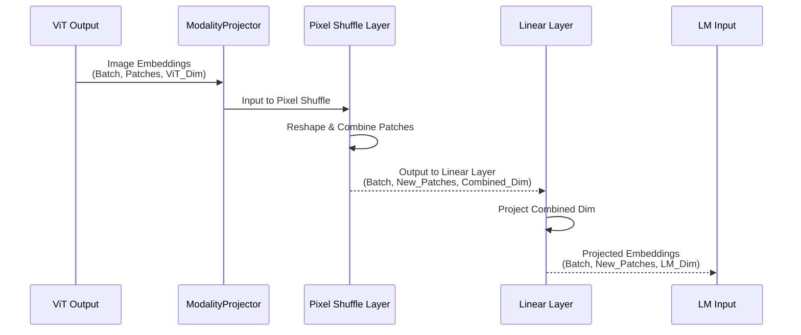

# Chapter 3: Modality Projector (MP)

Welcome back to the nanoVLM tutorial! In the previous chapter, [Chapter 2: Vision Transformer (ViT)](02_vision_transformer__vit__.md), we learned how the Vision Transformer acts as the "eyes" of our model. It takes an image and transforms it into a sequence of numerical representations, or **embeddings**, that capture the visual information. The output of the ViT is a sequence of `num_patches` embeddings, each with a size of `vit_hidden_dim`.

Now, we have a sequence of image embeddings. The problem is, the next part of our model, the [Language Model (LM)](04_language_model__lm__.md), is expecting its input to be a sequence of *language* embeddings, each with a size of `lm_hidden_dim`. The format and size of the embeddings from the ViT (`vit_hidden_dim`) likely don't match what the LM needs (`lm_hidden_dim`). They speak different numerical "languages"!

This is where the **Modality Projector (MP)** comes in.

## The Bridge Between Vision and Language

Imagine you have a translator who can understand one language (like visual features) and convert that understanding into another language (like numerical vectors that a text model can process). The Modality Projector is exactly that translator for our Vision-Language Model.

Its core job is to take the visual embeddings produced by the [Vision Transformer (ViT)](02_vision_transformer__vit__.md) and transform them so they look like the kind of embeddings that the [Language Model (LM)](04_language_model__lm__.md) expects as input. It **projects** the embeddings from the "vision space" into the "language space".

Why is this necessary?
*   The ViT might output embeddings of a different size (dimensionality) than the LM's hidden layers.
*   The number of visual embeddings (one per patch) might not be the ideal number to represent the image when combining it with text tokens.

The MP addresses these issues, creating a crucial link or "bridge" that allows the visual information to flow into the language understanding part of the model.

## How nanoVLM Uses the Modality Projector

Just like the ViT, the Modality Projector (`ModalityProjector` in the code) is a sub-module within the main [VisionLanguageModel (VLM)](05_visionlanguagemodel__vlm__.md).

In the `forward` pass of the `VisionLanguageModel`, after the image has been processed by the `vision_encoder` (the ViT), its output is immediately passed to the `ModalityProjector`.

Let's look at the relevant snippet from the `VisionLanguageModel`'s `forward` method (which we saw in previous chapters):

```python
# Simplified forward pass from VisionLanguageModel
def forward(self, input_ids, image, attention_mask=None, targets=None):
    # Image first goes into the ViT
    image_embd = self.vision_encoder(image)
    # The ViT output then goes into the Modality Projector
    image_embd = self.MP(image_embd)
    # ... image_embd is now in the format the LM expects ...

    token_embd = self.decoder.token_embedding(input_ids)

    # Concatenate the projected image embeddings with the text embeddings
    combined_embd = torch.cat((image_embd, token_embd), dim=1) 
    
    # ... rest of the process using combined_embd ...
    return logits, loss
```

The line `image_embd = self.MP(image_embd)` is where the Modality Projector does its work. It takes the `image_embd` output by the ViT and transforms it, overwriting the variable so that `image_embd` now holds the *projected* embeddings. These projected embeddings are then ready to be combined (`torch.cat`) with the `token_embd` (the embeddings of the text input) before being fed into the `decoder` (the Language Model).

## Under the Hood: How the Modality Projector Works

The Modality Projector needs to solve two main potential mismatches between the ViT output and the LM input:

1.  **Embedding Dimension Mismatch:** The size of the vector representing each visual piece (`vit_hidden_dim`) might not match the size of the vector the LM works with (`lm_hidden_dim`).
2.  **Sequence Length Mismatch:** The number of visual embeddings (related to the number of patches) might not be the desired number of visual "tokens" to prepend to the text tokens for the LM.

nanoVLM's `ModalityProjector` addresses this using a combination of a **reshaping step (`pixel_shuffle`)** and a **linear transformation (`nn.Linear`)**.

Here's a simplified walkthrough of what happens inside the MP:



Let's break down the steps and look at the code snippets from `models/modality_projector.py`:

### Step 1: Reshaping and Combining (`pixel_shuffle`)

The `pixel_shuffle` method in this MP implementation is adapted from a technique often used in image upsampling. Here, it's applied to the sequence of patch embeddings.

Its purpose is to take the sequence of patch embeddings and effectively group nearby patches, reducing the sequence length while increasing the dimensionality of the resulting vector by concatenating the features of the grouped patches.

```python
# From models/modality_projector.py
class ModalityProjector(nn.Module):
    def __init__(self, cfg):
        super().__init__()
        self.cfg = cfg
        # Calculates the input dimension for the linear layer after pixel shuffle
        self.input_dim = cfg.vit_hidden_dim * (cfg.mp_pixel_shuffle_factor**2) 
        # The desired output dimension for the LM
        self.output_dim = cfg.lm_hidden_dim
        # Factor used in pixel shuffle
        self.scale_factor = cfg.mp_pixel_shuffle_factor

        # The Linear Layer that does the dimension projection
        self.proj = nn.Linear(self.input_dim, self.output_dim, bias=False)
        
        # ... weight initialization ...

    # This method reshapes the sequence
    def pixel_shuffle(self, x):
        bsz, seq, embed_dim = x.size() # x is (Batch, Sequence, Embedding_Dim)
        # Assumes sequence length is a perfect square (from image patches)
        seq_root = int(seq**0.5)
        # ... checks for square and divisibility ...

        # Reshapes and permutes to group nearby patches
        # For simplicity, think of this as changing the shape
        # from (Batch, Patches, ViT_Dim)
        # to (Batch, Fewer_Patches, ViT_Dim * scale_factor^2)
        
        # Simplified view of the core operation
        # x = complex_reshape_and_permute(x) 
        
        height = width = seq_root
        x = x.view(bsz, height, width, embed_dim) # Reshape to spatial grid (Batch, H, W, Dim)
        h_out = height // self.scale_factor
        w_out = width // self.scale_factor
        
        # Group adjacent patches and stack their features
        x = x.reshape(bsz, h_out, self.scale_factor, w_out, self.scale_factor, embed_dim)
        x = x.permute(0, 1, 3, 2, 4, 5).contiguous()
        # Final shape before linear layer: Fewer patches, larger dimension
        x = x.reshape(bsz, h_out * w_out, embed_dim * self.scale_factor**2)
        
        return x
```

This `pixel_shuffle` method takes the sequence of embeddings `x` (with shape `(Batch, num_patches, vit_hidden_dim)`), reshapes it internally using the `scale_factor` defined in the [VLMConfig](01_vlmconfig_.md), and returns a new sequence. This new sequence has fewer items (`num_patches / scale_factor^2`), but each item's embedding dimension is now larger (`vit_hidden_dim * scale_factor^2`), containing combined information from multiple original patches. This output shape is `(Batch, new_num_patches, vit_hidden_dim * scale_factor^2)`.

### Step 2: Dimension Matching (`nn.Linear`)

After the reshaping and combining by `pixel_shuffle`, the sequence has the shape `(Batch, new_num_patches, vit_hidden_dim * scale_factor^2)`. The next step is to transform the *last* dimension (the embedding size) to match what the [Language Model (LM)](04_language_model__lm__.md) expects, which is `lm_hidden_dim`.

This is a standard operation done by a simple **linear layer** (`nn.Linear`). A linear layer essentially performs a matrix multiplication and potentially adds a bias.

```python
# From models/modality_projector.py (continued from above)
class ModalityProjector(nn.Module):
    def __init__(self, cfg):
        super().__init__()
        self.cfg = cfg
        self.input_dim = cfg.vit_hidden_dim * (cfg.mp_pixel_shuffle_factor**2)
        self.output_dim = cfg.lm_hidden_dim
        self.scale_factor = cfg.mp_pixel_shuffle_factor

        # The Linear Layer: takes vectors of size self.input_dim
        # and outputs vectors of size self.output_dim
        self.proj = nn.Linear(self.input_dim, self.output_dim, bias=False)
        
        self.apply(self._init_weights)

    # ... pixel_shuffle method ...

    # The main forward method puts it all together
    def forward(self, x):
        # First, reshape and combine patches
        x = self.pixel_shuffle(x) # Shape becomes (Batch, New_Patches, Combined_Dim)
        # Then, apply the linear layer to project the last dimension
        x = self.proj(x)         # Shape becomes (Batch, New_Patches, LM_Dim)

        return x # Return the projected embeddings
```

The `forward` method clearly shows the flow: input `x` goes through `self.pixel_shuffle` and then through `self.proj`. The linear layer `self.proj` takes the output of `pixel_shuffle` (shape `(Batch, new_num_patches, combined_dim)`) and transforms the last dimension (`combined_dim`) to `lm_hidden_dim`, resulting in the final output shape `(Batch, new_num_patches, lm_hidden_dim)`.

This final output `x` is now a sequence of image embeddings (`new_num_patches` items) where each embedding has the correct size (`lm_hidden_dim`) that the [Language Model (LM)](04_language_model__lm__.md) is designed to work with.

## Connecting to the Language Model

As shown in the `VisionLanguageModel`'s `forward` method snippet earlier, this projected sequence (`image_embd` after the `self.MP` call) is then concatenated with the embeddings of the input text tokens (`token_embd`).

```python
# Snippet showing combination from VisionLanguageModel forward
# image_embd is the output from the Modality Projector
image_embd = self.MP(image_embd) 

# Get embeddings for the text input
token_embd = self.decoder.token_embedding(input_ids)

# Combine image and text embeddings into a single sequence
combined_embd = torch.cat((image_embd, token_embd), dim=1) 

# Feed the combined sequence to the Language Model (decoder)
logits = self.decoder(combined_embd, attention_mask) 
```

The combined sequence `combined_embd` now starts with the visual tokens (produced by the ViT and transformed by the MP) followed by the text tokens. This sequence is fed into the `self.decoder` (the LM), allowing it to process both the image information and the text information together to generate the desired output.

## Conclusion

In this chapter, we explored the Modality Projector (MP), the vital link that bridges the gap between the visual features extracted by the [Vision Transformer (ViT)](02_vision_transformer__vit__.md) and the input format required by the [Language Model (LM)](04_language_model__lm__.md). We saw how it takes the ViT's output and transforms it, in nanoVLM's case using a reshaping step (`pixel_shuffle`) followed by a linear projection (`nn.Linear`), to produce a sequence of image embeddings that match the LM's expected size and format. This projected output is then combined with the text embeddings, creating a unified input sequence for the language model to process both modalities simultaneously.

Now that we understand how the visual information is prepared and passed along, let's dive into the component that handles the text understanding and generation: the Language Model.

[Next Chapter: Language Model (LM)](04_language_model__lm__.md)


