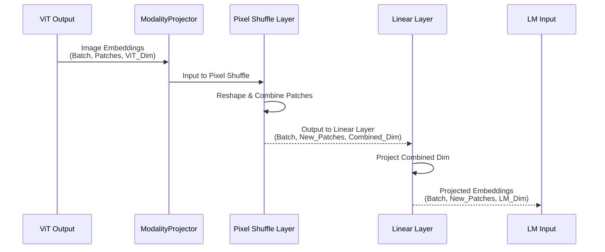

# 챕터 3: Modality Projector (MP)

nanoVLM 튜토리얼에 다시 오신 것을 환영합니다! 이전 챕터인 [챕터 2: Vision Transformer (ViT)](02_vision_transformer__vit__.md)에서 우리는 Vision Transformer가 모델의 "눈" 역할을 하는 방법을 배웠습니다. 이는 이미지를 받아 시각적 정보를 담은 수치적 표현, 즉 **embeddings**의 시퀀스로 변환합니다. ViT의 출력은 `num_patches`개의 embedding 시퀀스이며, 각각의 크기는 `vit_hidden_dim`입니다.

이제 우리는 이미지 embedding의 시퀀스를 가지고 있습니다. 문제는 모델의 다음 부분인 [Language Model (LM)](04_language_model__lm__.md)이 입력으로 *언어* embedding의 시퀀스를 기대하고 있으며, 각각의 크기는 `lm_hidden_dim`이라는 점입니다. ViT에서 나온 embedding의 형식과 크기(`vit_hidden_dim`)는 LM이 필요로 하는 것(`lm_hidden_dim`)과 일치하지 않을 가능성이 높습니다. 그들은 서로 다른 수치적 "언어"를 사용하고 있습니다!

이것이 바로 **Modality Projector (MP)**가 필요한 이유입니다.

## 시각과 언어 사이의 다리

한 언어(시각적 특징과 같은)를 이해하고 그 이해를 다른 언어(텍스트 모델이 처리할 수 있는 수치적 벡터와 같은)로 변환할 수 있는 번역가가 있다고 상상해보세요. Modality Projector는 바로 우리의 Vision-Language Model을 위한 그런 번역가입니다.

그 핵심 작업은 [Vision Transformer (ViT)](02_vision_transformer__vit__.md)가 생성한 시각적 embedding을 가져와서 [Language Model (LM)](04_language_model__lm__.md)이 입력으로 기대하는 종류의 embedding처럼 보이도록 변환하는 것입니다. 이는 embedding을 "시각 공간"에서 "언어 공간"으로 **투영**합니다.

왜 이것이 필요할까요?
* ViT는 LM의 hidden layer와 다른 크기(차원)의 embedding을 출력할 수 있습니다.
* 시각적 embedding의 수(patch당 하나)는 텍스트 토큰과 결합할 때 이미지를 나타내기에 이상적인 수가 아닐 수 있습니다.

MP는 이러한 문제들을 해결하여, 시각적 정보가 모델의 언어 이해 부분으로 흐를 수 있게 하는 중요한 연결 고리 또는 "다리"를 만듭니다.

## nanoVLM이 Modality Projector를 사용하는 방법

ViT와 마찬가지로, Modality Projector(코드에서는 `ModalityProjector`)는 메인 [VisionLanguageModel (VLM)](05_visionlanguagemodel__vlm__.md) 내의 하위 모듈입니다.

`VisionLanguageModel`의 `forward` 패스에서, 이미지가 `vision_encoder`(ViT)에 의해 처리된 후, 그 출력은 즉시 `ModalityProjector`로 전달됩니다.

`VisionLanguageModel`의 `forward` 메서드에서 관련된 코드 조각을 살펴보겠습니다(이전 챕터에서 보았던 것):

```python
# VisionLanguageModel의 단순화된 forward 패스
def forward(self, input_ids, image, attention_mask=None, targets=None):
    # 이미지는 먼저 ViT로 들어갑니다
    image_embd = self.vision_encoder(image)
    # ViT의 출력은 그 다음 Modality Projector로 들어갑니다
    image_embd = self.MP(image_embd)
    # ... image_embd는 이제 LM이 기대하는 형식입니다 ...

    token_embd = self.decoder.token_embedding(input_ids)

    # 투영된 이미지 embedding과 텍스트 embedding을 결합합니다
    combined_embd = torch.cat((image_embd, token_embd), dim=1) 
    
    # ... combined_embd를 사용한 나머지 처리 과정 ...
    return logits, loss
```

`image_embd = self.MP(image_embd)` 라인이 Modality Projector가 작업을 수행하는 곳입니다. 이는 ViT가 출력한 `image_embd`를 변환하여, 변수를 덮어쓰므로 `image_embd`는 이제 *투영된* embedding을 담고 있습니다. 이 투영된 embedding들은 그 다음 `token_embd`(텍스트 입력의 embedding)와 결합(`torch.cat`)되어 `decoder`(Language Model)에 입력되기 전에 준비됩니다.

## 내부 작동 방식: Modality Projector가 어떻게 작동하는가

Modality Projector는 ViT 출력과 LM 입력 사이의 두 가지 주요 불일치를 해결해야 합니다:

1. **Embedding 차원 불일치:** 각 시각적 부분을 나타내는 벡터의 크기(`vit_hidden_dim`)가 LM이 작업하는 벡터의 크기(`lm_hidden_dim`)와 일치하지 않을 수 있습니다.
2. **시퀀스 길이 불일치:** 시각적 embedding의 수(patch의 수와 관련)가 LM을 위한 텍스트 토큰 앞에 추가할 시각적 "토큰"의 원하는 수가 아닐 수 있습니다.

nanoVLM의 `ModalityProjector`는 **reshaping 단계(`pixel_shuffle`)**와 **선형 변환(`nn.Linear`)**의 조합을 사용하여 이를 해결합니다.

MP 내부에서 일어나는 일의 단순화된 설명입니다:



단계를 나누어 `models/modality_projector.py`의 코드 조각을 살펴보겠습니다:

### 1단계: Reshaping과 결합(`pixel_shuffle`)

이 MP 구현에서의 `pixel_shuffle` 메서드는 이미지 업샘플링에 자주 사용되는 기술에서 적응된 것입니다. 여기서는 patch embedding의 시퀀스에 적용됩니다.

그 목적은 patch embedding의 시퀀스를 가져와서 효과적으로 인접한 patch들을 그룹화하고, 그룹화된 patch들의 특징을 연결하여 결과 벡터의 차원을 증가시키면서 시퀀스 길이를 줄이는 것입니다.

```python
# From models/modality_projector.py
class ModalityProjector(nn.Module):
    def __init__(self, cfg):
        super().__init__()
        self.cfg = cfg
        # pixel shuffle 후 선형 레이어의 입력 차원 계산
        self.input_dim = cfg.vit_hidden_dim * (cfg.mp_pixel_shuffle_factor**2) 
        # LM을 위한 원하는 출력 차원
        self.output_dim = cfg.lm_hidden_dim
        # pixel shuffle에서 사용되는 factor
        self.scale_factor = cfg.mp_pixel_shuffle_factor

        # 차원 투영을 수행하는 선형 레이어
        self.proj = nn.Linear(self.input_dim, self.output_dim, bias=False)
        
        # ... 가중치 초기화 ...

    # 이 메서드는 시퀀스를 reshape합니다
    def pixel_shuffle(self, x):
        bsz, seq, embed_dim = x.size() # x는 (Batch, Sequence, Embedding_Dim)
        # 시퀀스 길이가 완전 제곱수라고 가정 (이미지 patch에서)
        seq_root = int(seq**0.5)
        # ... 제곱수와 나눗셈 가능성 검사 ...

        # 인접한 patch들을 그룹화하기 위해 reshape하고 permute
        # 단순화하면, 이것은 shape를
        # (Batch, Patches, ViT_Dim)에서
        # (Batch, Fewer_Patches, ViT_Dim * scale_factor^2)로 변경하는 것
        
        # 핵심 연산의 단순화된 뷰
        # x = complex_reshape_and_permute(x) 
        
        height = width = seq_root
        x = x.view(bsz, height, width, embed_dim) # 공간 그리드로 reshape (Batch, H, W, Dim)
        h_out = height // self.scale_factor
        w_out = width // self.scale_factor
        
        # 인접한 patch들을 그룹화하고 그 특징들을 쌓음
        x = x.reshape(bsz, h_out, self.scale_factor, w_out, self.scale_factor, embed_dim)
        x = x.permute(0, 1, 3, 2, 4, 5).contiguous()
        # 선형 레이어 전 최종 shape: 더 적은 patch, 더 큰 차원
        x = x.reshape(bsz, h_out * w_out, embed_dim * self.scale_factor**2)
        
        return x
```

이 `pixel_shuffle` 메서드는 embedding의 시퀀스 `x`(shape `(Batch, num_patches, vit_hidden_dim)`)를 가져와서 [VLMConfig](01_vlmconfig_.md)에 정의된 `scale_factor`를 사용하여 내부적으로 reshape하고, 새로운 시퀀스를 반환합니다. 이 새로운 시퀀스는 더 적은 항목(`num_patches / scale_factor^2`)을 가지고 있지만, 각 항목의 embedding 차원은 이제 더 큽니다(`vit_hidden_dim * scale_factor^2`). 이는 여러 원본 patch들의 결합된 정보를 포함합니다. 이 출력 shape는 `(Batch, new_num_patches, vit_hidden_dim * scale_factor^2)`입니다.

### 2단계: 차원 매칭(`nn.Linear`)

`pixel_shuffle`에 의한 reshaping과 결합 후, 시퀀스는 shape `(Batch, new_num_patches, vit_hidden_dim * scale_factor^2)`를 가집니다. 다음 단계는 *마지막* 차원(embedding 크기)을 [Language Model (LM)](04_language_model__lm__.md)이 기대하는 것인 `lm_hidden_dim`과 일치하도록 변환하는 것입니다.

이는 단순한 **선형 레이어**(`nn.Linear`)에 의해 수행되는 표준 연산입니다. 선형 레이어는 본질적으로 행렬 곱셈을 수행하고 잠재적으로 bias를 추가합니다.

```python
# From models/modality_projector.py (위에서 계속)
class ModalityProjector(nn.Module):
    def __init__(self, cfg):
        super().__init__()
        self.cfg = cfg
        self.input_dim = cfg.vit_hidden_dim * (cfg.mp_pixel_shuffle_factor**2)
        self.output_dim = cfg.lm_hidden_dim
        self.scale_factor = cfg.mp_pixel_shuffle_factor

        # 선형 레이어: 크기 self.input_dim의 벡터를 입력으로 받아
        # 크기 self.output_dim의 벡터를 출력
        self.proj = nn.Linear(self.input_dim, self.output_dim, bias=False)
        
        self.apply(self._init_weights)

    # ... pixel_shuffle 메서드 ...

    # 메인 forward 메서드는 모든 것을 함께 모읍니다
    def forward(self, x):
        # 먼저, patch들을 reshape하고 결합
        x = self.pixel_shuffle(x) # Shape가 (Batch, New_Patches, Combined_Dim)이 됨
        # 그 다음, 마지막 차원을 투영하기 위해 선형 레이어 적용
        x = self.proj(x)         # Shape가 (Batch, New_Patches, LM_Dim)이 됨

        return x # 투영된 embedding 반환
```

`forward` 메서드는 흐름을 명확하게 보여줍니다: 입력 `x`는 `self.pixel_shuffle`을 통과한 다음 `self.proj`를 통과합니다. 선형 레이어 `self.proj`는 `pixel_shuffle`의 출력(shape `(Batch, new_num_patches, combined_dim)`)을 가져와 마지막 차원(`combined_dim`)을 `lm_hidden_dim`으로 변환하여, 최종 출력 shape `(Batch, new_num_patches, lm_hidden_dim)`을 만듭니다.

이 최종 출력 `x`는 이제 이미지 embedding의 시퀀스(`new_num_patches` 항목)이며, 각 embedding은 [Language Model (LM)](04_language_model__lm__.md)이 작업하도록 설계된 올바른 크기(`lm_hidden_dim`)를 가집니다.

## Language Model에 연결하기

앞서 본 `VisionLanguageModel`의 `forward` 메서드 조각에서 보여주었듯이, 이 투영된 시퀀스(`self.MP` 호출 후의 `image_embd`)는 그 다음 입력 텍스트 토큰의 embedding(`token_embd`)과 연결됩니다.

```python
# VisionLanguageModel forward에서 결합을 보여주는 조각
# image_embd는 Modality Projector의 출력입니다
image_embd = self.MP(image_embd) 

# 텍스트 입력의 embedding을 얻습니다
token_embd = self.decoder.token_embedding(input_ids)

# 이미지와 텍스트 embedding을 하나의 시퀀스로 결합합니다
combined_embd = torch.cat((image_embd, token_embd), dim=1) 

# 결합된 시퀀스를 Language Model(decoder)에 입력합니다
logits = self.decoder(combined_embd, attention_mask) 
```

결합된 시퀀스 `combined_embd`는 이제 시각적 토큰(ViT에 의해 생성되고 MP에 의해 변환된)으로 시작하고 그 뒤에 텍스트 토큰이 옵니다. 이 시퀀스는 `self.decoder`(LM)에 입력되어, 이미지 정보와 텍스트 정보를 함께 처리하여 원하는 출력을 생성할 수 있게 합니다.

## 결론

이 챕터에서 우리는 [Vision Transformer (ViT)](02_vision_transformer__vit__.md)가 추출한 시각적 특징과 [Language Model (LM)](04_language_model__lm__.md)이 필요로 하는 입력 형식 사이의 간격을 메우는 중요한 연결 고리인 Modality Projector (MP)를 살펴보았습니다. 우리는 nanoVLM의 경우 reshaping 단계(`pixel_shuffle`)와 그 뒤의 선형 투영(`nn.Linear`)을 사용하여 ViT의 출력을 변환하고, LM이 기대하는 크기와 형식과 일치하는 이미지 embedding의 시퀀스를 생성하는 방법을 보았습니다. 이 투영된 출력은 그 다음 텍스트 embedding과 결합되어, 언어 모델이 두 모달리티를 동시에 처리할 수 있는 통합된 입력 시퀀스를 만듭니다.

이제 시각적 정보가 어떻게 준비되고 전달되는지 이해했으니, 텍스트 이해와 생성을 처리하는 컴포넌트인 Language Model을 살펴보겠습니다.

[다음 챕터: Language Model (LM)](04_language_model__lm__.md) 