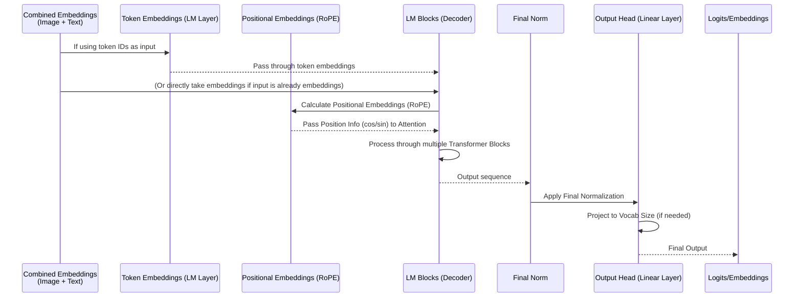

# Chapter 4: Language Model (LM)

Welcome back to the nanoVLM tutorial! In our previous chapter, [Chapter 3: Modality Projector (MP)](03_modality_projector__mp__.md), we learned how the Modality Projector acts as a translator, taking the visual information processed by the [Vision Transformer (ViT)](02_vision_transformer__vit__.md) and converting it into a format that the language part of our model can understand. The output of the MP is a sequence of special "image" embeddings, ready to be combined with text.

Now, let's talk about the component that makes nanoVLM truly conversational: the **Language Model (LM)**.

## The "Brain" for Text: What is a Language Model?

Imagine a super-smart text predictor. That's essentially what a Language Model is. Its main job is to understand sequences of text and predict what comes next. If you give it "The cat sat on the...", a good LM is very likely to predict "mat".

In the context of a Vision-Language Model like nanoVLM, the LM is the **"voice" and "brain"** that handles the text part of the conversation. It receives input that includes *both* the image information (processed by the ViT and MP) *and* the text prompt you give it (like a question). Based on this combined input, the LM generates the text output – your answer!

Think of it this way:

1.  You show nanoVLM an image and ask, "What color is the sky?".
2.  The [Vision Transformer (ViT)](02_vision_transformer__vit__.md) looks at the image and extracts visual features.
3.  The [Modality Projector (MP)](03_modality_projector__mp__.md) translates those visual features into a sequence of numerical "image" embeddings.
4.  Your text question "What color is the sky?" is turned into a sequence of numerical "text" embeddings.
5.  The **Language Model (LM)** receives *both* the "image" embeddings *and* the "text" embeddings as a single combined input sequence.
6.  Based on this combined sequence, the LM processes it and starts generating new text embeddings, which are then converted back into words to form the answer (e.g., "blue").

The LM is the part of the model that *generates* the final text response, taking into account everything it has "seen" (through the ViT and MP) and "read" (from your text prompt).

## How nanoVLM Uses the Language Model

In nanoVLM's code, the Language Model is represented by the `LanguageModel` class and is a major component of the main [VisionLanguageModel (VLM)](05_visionlanguagemodel__vlm__.md). Inside the `VisionLanguageModel`, the LM instance is usually named `decoder`.

As we saw in the previous chapter, the `VisionLanguageModel`'s `forward` method first processes the image and then the text input (`input_ids`), combines their embeddings, and then passes this combined sequence to the `decoder` (the LM).

Here's a simplified view focusing on the LM call:

```python
# Simplified forward pass from VisionLanguageModel
def forward(self, input_ids, image, attention_mask=None, targets=None):
    # ... process image through ViT and MP ...
    image_embd = self.MP(self.vision_encoder(image)) # Projected image embeddings

    # Get embeddings for the text input using the LM's embedding layer
    token_embd = self.decoder.token_embedding(input_ids) 

    # Combine image and text embeddings into a single sequence
    combined_embd = torch.cat((image_embd, token_embd), dim=1) 
    
    # Adjust attention mask for the combined sequence (covers image and text)
    # ... (details covered in VLM chapter) ...

    # **The LM processes the combined sequence**
    # The LM's forward method takes embeddings as input
    lm_output_embeddings = self.decoder(combined_embd, attention_mask) 

    # The LM might output embeddings or logits depending on config (lm_use_tokens)
    # In VLM, we typically use lm_use_tokens=True for training the head
    # and often lm_use_tokens=False for generation speed/simplicity depending on architecture
    # If lm_use_tokens is True, the decoder's head layer is applied *after* this call
    # to get the final word predictions (logits).
    
    # ... rest of the process (like calculating loss or getting logits) ...
    return logits, loss
```

The key line here is `lm_output_embeddings = self.decoder(combined_embd, attention_mask)`. The `self.decoder` (our `LanguageModel` instance) takes the full sequence (projected image embeddings followed by text embeddings) and processes it. It outputs a sequence of embeddings (or potentially logits, depending on configuration) that represent the model's understanding and readiness to predict the next tokens.

During the `generate` process (when the model is asked to produce an answer), the `VisionLanguageModel` repeatedly calls the `self.decoder` with the current sequence of embeddings (starting with the image embeddings and the initial text prompt embeddings), takes the output for the *last* token in the sequence, predicts the next token (word), converts that predicted token back into an embedding, and appends it to the sequence for the next step.

## Under the Hood: How the Language Model Works

nanoVLM's `LanguageModel` is based on the powerful **Transformer decoder** architecture, similar to models like Llama. Its structure is designed to process a sequence and predict the *next* item in that sequence.

Here's a simplified step-by-step walkthrough of what happens inside the `LanguageModel`'s `forward` pass when it receives the `combined_embd` sequence:



Let's look at the key components within the `LanguageModel`:

1.  **Token Embedding (`token_embedding`):** If the initial input to the LM's `forward` method is token IDs (numbers representing words/tokens), this layer converts them into numerical vectors (embeddings). In nanoVLM's `VisionLanguageModel`'s `forward` and `generate`, the LM's `token_embedding` layer is called *before* the `self.decoder` call to get embeddings for the *text* part of the input. The LM's `forward` method then receives the *already-embedded* sequence (`combined_embd`). The `lm_use_tokens` flag in the LM controls if the `token_embedding` layer is used internally or if the input is assumed to be embeddings already.
2.  **Positional Embeddings (`rotary_embd`):** Like the ViT, Transformers need to know the position of items in the sequence. Language models often use techniques like Rotary Position Embeddings (RoPE). This component calculates special vectors (`cos` and `sin`) based on the position of each item in the sequence. These vectors are then used *within* the attention mechanism in each Transformer block.
3.  **Transformer Blocks (`blocks`):** This is the core processing engine. It consists of multiple layers (`lm_n_blocks` defined in [VLMConfig](01_vlmconfig_.md)). Each block typically contains:
    *   **Attention:** Allows the model to weigh the importance of different parts of the input sequence when processing each element. In a decoder, this is usually *masked* self-attention, meaning a token can only attend to itself and previous tokens in the sequence. This is crucial for generation, as the model shouldn't peek at future tokens.
    *   **MLP (Feed-Forward Network):** Further processes the information for each position in the sequence independently.
4.  **Normalization (`norm`):** Layers like RMSNorm (Root Mean Square Layer Normalization) help stabilize training. They are applied within blocks and often at the end of the stack of blocks.
5.  **Output Head (`head`):** A final linear layer that takes the processed embeddings for each position in the sequence and projects them to the size of the vocabulary (`lm_vocab_size`). The output of this layer (called logits) tells the model the probability of each possible word/token being the *next* one in the sequence. The `lm_use_tokens` flag also controls if this head layer is applied *inside* the LM's `forward` or *after* the call, as seen in the VLM's `forward` for loss calculation.

Let's look at snippets from `models/language_model.py`.

### The `LanguageModel` Class Structure

The main `LanguageModel` class sets up these components based on the configuration:

```python
# From models/language_model.py
class LanguageModel(nn.Module):
    def __init__(self, cfg):
        super().__init__()
        self.cfg = cfg
        # Determines if input is token IDs or embeddings
        self.lm_use_tokens = cfg.lm_use_tokens 
        self.lm_tie_weights = cfg.lm_tie_weights # If output head shares weights with embedding layer

        # 1. Layer to convert token IDs to embeddings (used by VLM's forward/generate too)
        self.token_embedding = nn.Embedding(cfg.lm_vocab_size, cfg.lm_hidden_dim)
        # 2. Component for positional embeddings
        self.rotary_embd = RotaryEmbedding(cfg)
        # 3. Stack of Transformer Blocks
        self.blocks = nn.ModuleList([
            LanguageModelBlock(cfg) for _ in range(cfg.lm_n_blocks)
        ])
        # 4. Final Normalization layer
        self.norm = RMSNorm(cfg) 
        # 5. Output layer to predict next token logits
        self.head = nn.Linear(cfg.lm_hidden_dim, cfg.lm_vocab_size, bias=False)
        
        # Optionally tie the input and output weights
        if self.lm_tie_weights:
            self.head.weight = self.token_embedding.weight

        # ... weight initialization ...
        
    # ... forward and generate methods below ...
    # ... from_pretrained method below ...
```

This `__init__` method shows how the LM is composed of standard Transformer building blocks. The number of `blocks` and their size (`lm_hidden_dim`) are determined by the [VLMConfig](01_vlmconfig_.md).

### The `LanguageModel` `forward` Method

The `forward` method processes the input sequence:

```python
# From models/language_model.py
class LanguageModel(nn.Module):
    # ... __init__ method above ...

    def forward(self, x, attention_mask=None):
        # If lm_use_tokens is True, convert input token IDs to embeddings *here*.
        # In VLM, input 'x' to LM is usually already embeddings (the combined_embd)
        # so this check might make more sense if LM was used standalone.
        if self.lm_use_tokens and x.dtype == torch.long: # Check dtype to be safe
             x = self.token_embedding(x) 
        
        B , T, C = x.size() # Batch, Sequence Length, Embedding Dimension
        
        # Calculate positional embeddings for the current sequence length (T)
        position_ids = torch.arange(T, device=x.device).unsqueeze(0).expand(B, -1) 
        cos, sin = self.rotary_embd(position_ids) 

        # Pass the sequence through all the blocks
        for block in self.blocks:
            # Each block applies attention and MLP, using position info and mask
            x = block(x, cos, sin, attention_mask) 
            
        # Apply final normalization
        x = self.norm(x)

        # If lm_use_tokens is True, apply the head layer to get logits (vocab size output)
        # If lm_use_tokens is False, return embeddings (hidden_dim output)
        if self.lm_use_tokens:
            x = self.head(x) 

        return x # Returns sequence of logits or embeddings
```

The `forward` method is the core computation. It applies positional information and feeds the sequence through the stack of `LanguageModelBlock`s. The output `x` represents the processed sequence, which is then potentially converted to logits by the `self.head` if `lm_use_tokens` is true.

### The `LanguageModelBlock` (Simplified)

Each `LanguageModelBlock` is a standard Transformer decoder layer (without cross-attention in this case, as the visual and text information are already combined in the input sequence).

```python
# From models/language_model.py
class LanguageModelBlock(nn.Module):
    def __init__(self, cfg):
        super().__init__()
        # MLP part
        self.mlp = LanguageModelMLP(cfg)
        # Attention part (Grouped Query Attention for efficiency)
        self.attn = LanguageModelGroupedQueryAttention(cfg)
        # Normalization layers
        self.norm1 = RMSNorm(cfg) # Input Norm
        self.norm2 = RMSNorm(cfg) # Post Attention Norm
    
    def forward(self, x, cos, sin, attention_mask=None):
        # Residual connection around Attention
        res = x
        x = self.norm1(x) # Apply norm before attention
        x = self.attn(x, cos, sin, attention_mask) # Apply attention
        x = res + x # Add residual

        # Residual connection around MLP
        res = x
        x = self.norm2(x) # Apply norm before MLP
        x = self.mlp(x)   # Apply MLP
        x = res + x     # Add residual

        return x # Output processed sequence
```

This block structure, repeated many times (`lm_n_blocks`), is what allows the LM to learn complex patterns and relationships across the combined visual and text sequence.

### Loading Pre-trained Language Models

Training a good language model from scratch requires massive amounts of text data and computation. Fortunately, we can often start with a Language Model that has already been trained on a huge corpus of text (like Llama, SmolLM, etc.). nanoVLM's `LanguageModel` class includes a `from_pretrained` class method to load the weights from such a model, as specified by `cfg.lm_model_type`.

```python
# From models/language_model.py
class LanguageModel(nn.Module):
    # ... methods above ...

    @classmethod
    def from_pretrained(cls, cfg):
        # This method handles downloading weights from Hugging Face Hub
        # based on cfg.lm_model_type (e.g., 'HuggingFaceTB/smollm-248M-init')
        # It then maps the names of the layers in the downloaded model
        # to the layer names in our LanguageModel class and loads the weights.
        # It also handles things like potentially increasing the vocabulary size
        # if our configuration requires it.
        print(f"Loading Language Model weights from: {cfg.lm_model_type}")
        # ... complex loading and mapping logic ...
        model = cls(cfg) # Create our model instance first
        # ... load weights into model ...
        print("Language Model loaded successfully!")
        return model
```

As seen in [Chapter 1: VLMConfig](01_vlmconfig_.md), the main [VisionLanguageModel (VLM)](05_visionlanguagemodel__vlm__.md) uses this `LanguageModel.from_pretrained(cfg)` method if `load_backbone=True`, giving our VLM a strong initial text understanding capability.

## Conclusion

In this chapter, we've explored the Language Model (LM), the component that acts as the "brain" for text in nanoVLM. We learned that it's responsible for processing the combined sequence of projected image embeddings (from the ViT and MP) and text prompt embeddings. Using a Transformer decoder architecture, it understands the context and generates the resulting text output. We saw how the LM is integrated into the `VisionLanguageModel` and its core components like token embeddings, positional information, Transformer blocks, and the output head. By often loading pre-trained weights, the LM gives nanoVLM a powerful ability to understand and generate human-like text.

We've now covered the individual components: the `VLMConfig` blueprint, the `VisionTransformer` (eyes), the `ModalityProjector` (translator), and the `LanguageModel` (text brain). In the next chapter, we'll bring all these pieces together to understand the complete [VisionLanguageModel (VLM)](05_visionlanguagemodel__vlm__.md) and how it orchestrates these components to perform multimodal tasks.

[Next Chapter: VisionLanguageModel (VLM)](05_visionlanguagemodel__vlm__.md)


