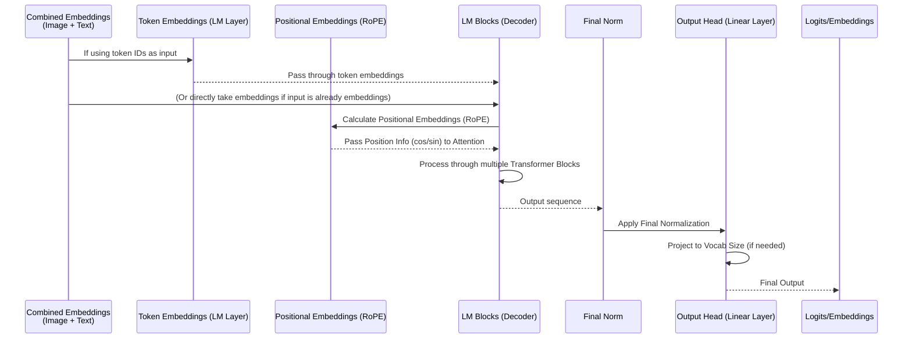

# 챕터 4: Language Model (LM)

nanoVLM 튜토리얼에 다시 오신 것을 환영합니다! 이전 챕터인 [챕터 3: Modality Projector (MP)](03_modality_projector__mp__.md)에서는 [Vision Transformer (ViT)](02_vision_transformer__vit__.md)가 처리한 시각 정보를 Modality Projector가 번역가처럼 변환하여, 모델의 언어 부분이 이해할 수 있는 형식으로 만드는 과정을 배웠습니다. MP의 출력은 텍스트와 결합할 준비가 된 특별한 "image" embedding의 시퀀스입니다.

이제 nanoVLM을 진정한 대화형 모델로 만들어주는 컴포넌트, **Language Model (LM)**에 대해 이야기해봅시다.

## 텍스트를 위한 "두뇌": Language Model이란?

초고도 지능의 텍스트 예측기를 상상해보세요. 그것이 바로 Language Model입니다. LM의 주요 역할은 텍스트 시퀀스를 이해하고 다음에 올 내용을 예측하는 것입니다. 예를 들어 "The cat sat on the..."을 입력하면, 좋은 LM은 "mat"을 예측할 확률이 높습니다.

Vision-Language Model(nanoVLM 등)에서 LM은 대화의 텍스트 부분을 담당하는 **"목소리"이자 "두뇌"**입니다. 이 LM은 *이미지 정보*(ViT와 MP가 처리한)와 *텍스트 프롬프트*(예: 질문)를 모두 입력으로 받아, 이 결합된 입력을 바탕으로 텍스트 출력을 생성합니다. 즉, 답변을 만들어내는 역할을 합니다!

정리하면:

1. nanoVLM에 이미지를 보여주고 "What color is the sky?"라고 묻습니다.
2. [Vision Transformer (ViT)](02_vision_transformer__vit__.md)가 이미지를 보고 시각적 특징을 추출합니다.
3. [Modality Projector (MP)](03_modality_projector__mp__.md)가 그 시각적 특징을 수치적 "image" embedding 시퀀스로 변환합니다.
4. 질문 "What color is the sky?"는 수치적 "text" embedding 시퀀스로 변환됩니다.
5. **Language Model (LM)**은 *image* embedding과 *text* embedding을 하나의 결합된 입력 시퀀스로 받습니다.
6. 이 결합된 시퀀스를 바탕으로 LM이 처리하여 새로운 텍스트 embedding을 생성하고, 이를 다시 단어로 변환하여 답변(예: "blue")을 만듭니다.

LM은 ViT와 MP를 통해 "본 것"과(이미지) "읽은 것"(텍스트 프롬프트)을 모두 고려하여 최종 텍스트 응답을 *생성*하는 모델의 부분입니다.

## nanoVLM에서 Language Model의 사용

nanoVLM 코드에서 Language Model은 `LanguageModel` 클래스로 구현되어 있으며, 메인 [VisionLanguageModel (VLM)](05_visionlanguagemodel__vlm__.md)의 주요 컴포넌트입니다. `VisionLanguageModel` 내부에서 LM 인스턴스는 보통 `decoder`로 명명됩니다.

이전 챕터에서 보았듯이, `VisionLanguageModel`의 `forward` 메서드는 먼저 이미지를 처리하고, 그 다음 텍스트 입력(`input_ids`)을 처리하여 embedding을 결합한 뒤, 이 결합된 시퀀스를 `decoder`(LM)에 전달합니다.

LM 호출에 초점을 맞춘 단순화된 예시는 다음과 같습니다:

```python
# VisionLanguageModel의 단순화된 forward 패스
def forward(self, input_ids, image, attention_mask=None, targets=None):
    # ... ViT와 MP를 통해 이미지 처리 ...
    image_embd = self.MP(self.vision_encoder(image)) # 투영된 이미지 embedding

    # LM의 embedding 레이어를 사용해 텍스트 입력 embedding 획득
    token_embd = self.decoder.token_embedding(input_ids) 

    # 이미지와 텍스트 embedding을 하나의 시퀀스로 결합
    combined_embd = torch.cat((image_embd, token_embd), dim=1) 
    
    # 결합된 시퀀스에 대한 attention mask 조정 (이미지+텍스트 모두 포함)
    # ... (VLM 챕터에서 자세히 다룸) ...

    # **LM이 결합된 시퀀스를 처리**
    # LM의 forward는 embedding 시퀀스를 입력으로 받음
    lm_output_embeddings = self.decoder(combined_embd, attention_mask) 

    # LM은 config(lm_use_tokens)에 따라 embedding 또는 logits을 출력할 수 있음
    # VLM에서는 보통 학습 시 lm_use_tokens=True, 생성 시에는 아키텍처에 따라 False를 사용
    # lm_use_tokens가 True면, decoder의 head 레이어가 이 호출 *후*에 적용되어 최종 단어 예측(logits)을 얻음
    
    # ... 나머지 처리(예: loss 계산, logits 획득 등) ...
    return logits, loss
```

여기서 핵심은 `lm_output_embeddings = self.decoder(combined_embd, attention_mask)`입니다. `self.decoder`(즉, `LanguageModel` 인스턴스)는 전체 시퀀스(투영된 이미지 embedding + 텍스트 embedding)를 받아 처리합니다. 그 결과는 모델의 이해와 다음 토큰 예측 준비 상태를 나타내는 embedding(또는 config에 따라 logits) 시퀀스입니다.

`generate` 과정(모델이 답변을 생성할 때)에서는, `VisionLanguageModel`이 현재 embedding 시퀀스(이미지 embedding과 초기 텍스트 프롬프트 embedding으로 시작)를 가지고 반복적으로 `self.decoder`를 호출합니다. 시퀀스의 *마지막* 토큰에 대한 출력을 받아 다음 토큰(단어)을 예측하고, 예측된 토큰을 embedding으로 변환하여 시퀀스에 추가하는 과정을 반복합니다.

## 내부 작동 방식: Language Model의 원리

nanoVLM의 `LanguageModel`은 Llama와 같은 모델과 유사한 강력한 **Transformer decoder** 아키텍처를 기반으로 합니다. 이 구조는 시퀀스를 처리하고 그 시퀀스의 *다음* 항목을 예측하도록 설계되어 있습니다.

`LanguageModel`의 `forward` 패스에서 `combined_embd` 시퀀스를 받았을 때 내부적으로 일어나는 일을 단계별로 살펴보면 다음과 같습니다:



`LanguageModel`의 주요 컴포넌트는 다음과 같습니다:

1. **Token Embedding (`token_embedding`):** LM의 `forward`에 토큰 ID(단어/토큰을 나타내는 숫자)가 입력되면, 이 레이어가 이를 수치적 벡터(embedding)로 변환합니다. nanoVLM의 `VisionLanguageModel`의 `forward`와 `generate`에서는 LM의 `token_embedding` 레이어가 *텍스트* 부분의 embedding을 얻기 위해 호출되고, LM의 `forward`에는 이미 embedding된 시퀀스(`combined_embd`)가 전달됩니다. LM의 `lm_use_tokens` 플래그는 내부적으로 `token_embedding`을 사용할지, 아니면 이미 embedding된 입력을 받을지 제어합니다.
2. **Positional Embeddings (`rotary_embd`):** ViT와 마찬가지로, Transformer는 시퀀스 내 각 항목의 위치를 알아야 합니다. Language Model은 보통 Rotary Position Embeddings(RoPE)와 같은 기법을 사용합니다. 이 컴포넌트는 각 항목의 위치에 따라 특수 벡터(`cos`, `sin`)를 계산하고, 이는 각 Transformer 블록의 attention 메커니즘 내에서 사용됩니다.
3. **Transformer Blocks (`blocks`):** 핵심 처리 엔진입니다. 여러 레이어(`lm_n_blocks`, [VLMConfig](01_vlmconfig_.md)에서 정의됨)로 구성됩니다. 각 블록은 보통 다음을 포함합니다:
    * **Attention:** 입력 시퀀스의 각 요소를 처리할 때 다른 부분의 중요도를 가중치로 반영합니다. 디코더에서는 보통 *masked* self-attention을 사용하여, 토큰이 자신과 이전 토큰만 참조할 수 있게 합니다(생성 시 미래 토큰을 미리 보면 안 되기 때문).
    * **MLP (Feed-Forward Network):** 시퀀스의 각 위치에 대해 정보를 독립적으로 추가 처리합니다.
4. **Normalization (`norm`):** RMSNorm(Root Mean Square Layer Normalization)과 같은 레이어는 학습을 안정화합니다. 블록 내부와 블록 스택의 끝에 적용됩니다.
5. **Output Head (`head`):** 시퀀스의 각 위치에 대해 처리된 embedding을 받아 vocabulary 크기(`lm_vocab_size`)로 투영하는 최종 선형 레이어입니다. 이 레이어의 출력(logits)은 다음에 올 단어/토큰의 확률을 나타냅니다. `lm_use_tokens` 플래그는 이 head 레이어가 LM의 `forward` 내부에서 적용될지, 호출 후에 적용될지 제어합니다.

`models/language_model.py`의 코드 조각을 살펴보겠습니다.

### `LanguageModel` 클래스 구조

메인 `LanguageModel` 클래스는 설정에 따라 다음과 같이 컴포넌트들을 구성합니다:

```python
# From models/language_model.py
class LanguageModel(nn.Module):
    def __init__(self, cfg):
        super().__init__()
        self.cfg = cfg
        # 입력이 토큰 ID인지 embedding인지 결정
        self.lm_use_tokens = cfg.lm_use_tokens 
        self.lm_tie_weights = cfg.lm_tie_weights # output head와 embedding 레이어의 가중치 공유 여부

        # 1. 토큰 ID를 embedding으로 변환하는 레이어 (VLM의 forward/generate에서도 사용)
        self.token_embedding = nn.Embedding(cfg.lm_vocab_size, cfg.lm_hidden_dim)
        # 2. 위치 embedding 컴포넌트
        self.rotary_embd = RotaryEmbedding(cfg)
        # 3. Transformer 블록 스택
        self.blocks = nn.ModuleList([
            LanguageModelBlock(cfg) for _ in range(cfg.lm_n_blocks)
        ])
        # 4. 최종 정규화 레이어
        self.norm = RMSNorm(cfg) 
        # 5. 다음 토큰 logits 예측을 위한 출력 레이어
        self.head = nn.Linear(cfg.lm_hidden_dim, cfg.lm_vocab_size, bias=False)
        
        # 입력과 출력 가중치 공유 옵션
        if self.lm_tie_weights:
            self.head.weight = self.token_embedding.weight

        # ... 가중치 초기화 ...
        
    # ... forward, generate, from_pretrained 등 ...
```

이 `__init__` 메서드는 LM이 표준 Transformer 빌딩 블록으로 구성됨을 보여줍니다. `blocks`의 개수와 크기(`lm_hidden_dim`)는 [VLMConfig](01_vlmconfig_.md)에서 결정됩니다.

### `LanguageModel`의 `forward` 메서드

`forward` 메서드는 입력 시퀀스를 처리합니다:

```python
# From models/language_model.py
class LanguageModel(nn.Module):
    # ... __init__ ...

    def forward(self, x, attention_mask=None):
        # lm_use_tokens가 True면, 입력 토큰 ID를 여기서 embedding으로 변환
        # VLM에서는 LM의 입력 'x'가 이미 embedding(즉, combined_embd)인 경우가 많음
        if self.lm_use_tokens and x.dtype == torch.long: # dtype 체크
             x = self.token_embedding(x) 
        
        B , T, C = x.size() # 배치, 시퀀스 길이, embedding 차원
        
        # 현재 시퀀스 길이(T)에 대한 위치 embedding 계산
        position_ids = torch.arange(T, device=x.device).unsqueeze(0).expand(B, -1) 
        cos, sin = self.rotary_embd(position_ids) 

        # 모든 블록을 통과
        for block in self.blocks:
            # 각 블록은 position info와 mask를 사용해 attention/MLP 적용
            x = block(x, cos, sin, attention_mask) 
            
        # 최종 정규화
        x = self.norm(x)

        # lm_use_tokens가 True면 head 레이어로 logits 반환, 아니면 embedding 반환
        if self.lm_use_tokens:
            x = self.head(x) 

        return x # logits 또는 embedding 시퀀스 반환
```

`forward` 메서드는 위치 정보를 적용하고, 시퀀스를 `LanguageModelBlock` 스택에 통과시킵니다. 출력 `x`는 처리된 시퀀스를 나타내며, `lm_use_tokens`가 true면 `self.head`를 통해 logits로 변환됩니다.

### `LanguageModelBlock` (단순화)

각 `LanguageModelBlock`은 표준 Transformer decoder 레이어입니다(여기서는 cross-attention 없이, 시각+텍스트 정보가 이미 입력에 결합되어 있음).

```python
# From models/language_model.py
class LanguageModelBlock(nn.Module):
    def __init__(self, cfg):
        super().__init__()
        # MLP 부분
        self.mlp = LanguageModelMLP(cfg)
        # Attention 부분 (효율을 위한 Grouped Query Attention)
        self.attn = LanguageModelGroupedQueryAttention(cfg)
        # 정규화 레이어
        self.norm1 = RMSNorm(cfg) # 입력 정규화
        self.norm2 = RMSNorm(cfg) # Attention 후 정규화
    
    def forward(self, x, cos, sin, attention_mask=None):
        # Attention 주위에 residual connection
        res = x
        x = self.norm1(x) # attention 전 정규화
        x = self.attn(x, cos, sin, attention_mask) # attention 적용
        x = res + x # residual 더하기

        # MLP 주위에 residual connection
        res = x
        x = self.norm2(x) # MLP 전 정규화
        x = self.mlp(x)   # MLP 적용
        x = res + x     # residual 더하기

        return x # 처리된 시퀀스 반환
```

이 블록 구조가 여러 번 반복(`lm_n_blocks`)되어, LM이 결합된 시각+텍스트 시퀀스에서 복잡한 패턴과 관계를 학습할 수 있게 합니다.

### 사전학습된 Language Model 불러오기

좋은 Language Model을 처음부터 학습하려면 방대한 텍스트 데이터와 연산이 필요합니다. 다행히도, 이미 대규모 말뭉치로 학습된 Language Model(Llama, SmolLM 등)을 활용할 수 있습니다. nanoVLM의 `LanguageModel` 클래스는 `from_pretrained` 클래스 메서드를 제공하여, `cfg.lm_model_type`에 지정된 모델의 가중치를 불러올 수 있습니다.

```python
# From models/language_model.py
class LanguageModel(nn.Module):
    # ... 위 메서드들 ...

    @classmethod
    def from_pretrained(cls, cfg):
        # 이 메서드는 cfg.lm_model_type(예: 'HuggingFaceTB/smollm-248M-init')에 따라
        # Hugging Face Hub에서 가중치를 다운로드합니다.
        # 다운로드한 모델의 레이어 이름을 LanguageModel 클래스의 레이어 이름에 매핑하여 가중치를 로드합니다.
        # config에 따라 vocabulary 크기를 늘리는 등도 처리합니다.
        print(f"Loading Language Model weights from: {cfg.lm_model_type}")
        # ... 복잡한 로딩 및 매핑 로직 ...
        model = cls(cfg) # 모델 인스턴스 생성
        # ... 가중치 로드 ...
        print("Language Model loaded successfully!")
        return model
```

[챕터 1: VLMConfig](01_vlmconfig_.md)에서 보았듯이, 메인 [VisionLanguageModel (VLM)](05_visionlanguagemodel__vlm__.md)은 `load_backbone=True`일 때 이 `LanguageModel.from_pretrained(cfg)` 메서드를 사용하여, VLM에 강력한 초기 텍스트 이해 능력을 부여합니다.

## 결론

이 챕터에서는 nanoVLM에서 텍스트의 "두뇌" 역할을 하는 Language Model (LM)에 대해 살펴보았습니다. LM은 ViT와 MP에서 투영된 이미지 embedding과 텍스트 프롬프트 embedding의 결합 시퀀스를 처리하는 역할을 하며, Transformer decoder 아키텍처를 사용해 맥락을 이해하고 결과 텍스트 출력을 생성합니다. LM이 `VisionLanguageModel`에 어떻게 통합되는지, token embedding, 위치 정보, Transformer 블록, 출력 head 등 핵심 컴포넌트도 살펴보았습니다. 사전학습된 가중치를 자주 불러와서 nanoVLM이 인간과 유사한 텍스트를 이해하고 생성할 수 있는 강력한 능력을 갖추게 됩니다.

이제 우리는 각 컴포넌트(`VLMConfig` 청사진, `VisionTransformer`(눈), `ModalityProjector`(번역가), `LanguageModel`(텍스트 두뇌))를 모두 살펴보았습니다. 다음 챕터에서는 이 모든 조각을 합쳐, 완전한 [VisionLanguageModel (VLM)](05_visionlanguagemodel__vlm__.md)이 이 컴포넌트들을 어떻게 조율하여 멀티모달 작업을 수행하는지 알아보겠습니다. 