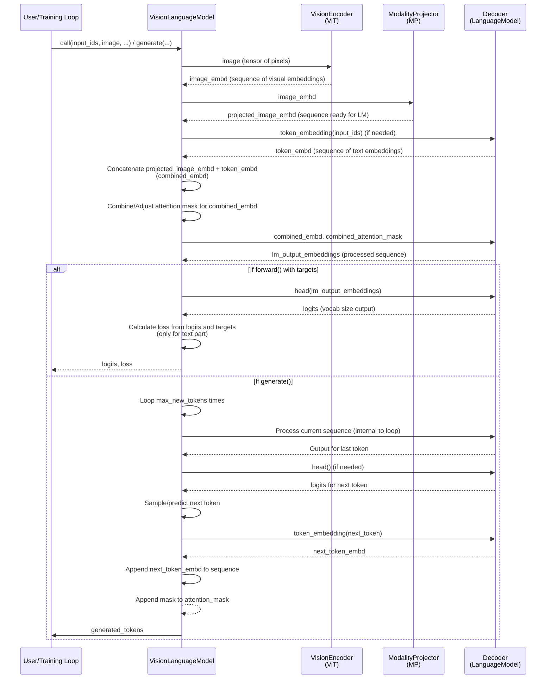

# Chapter 5: VisionLanguageModel (VLM)

Welcome back to the nanoVLM tutorial! Over the past few chapters, we've explored the individual building blocks of our Vision-Language Model:

*   [Chapter 1: VLMConfig](01_vlmconfig_.md): The blueprint that defines the model's structure.
*   [Chapter 2: Vision Transformer (ViT)](02_vision_transformer__vit__.md): The "eyes" that process the input image into numerical embeddings.
*   [Chapter 3: Modality Projector (MP)](03_modality_projector__mp__.md): The "translator" that converts image embeddings into a format the language model can understand.
*   [Chapter 4: Language Model (LM)](04_language_model__lm__.md): The "text brain" that processes sequences of embeddings (including the visual ones) and generates text output.

Now, in this chapter, we bring all these pieces together! We're going to explore the **`VisionLanguageModel` (VLM)** class itself.

## The Complete System: Orchestrating Vision and Language

Imagine you're directing a play. You have different actors (ViT, MP, LM), each with their specific roles. The **`VisionLanguageModel`** is the **director**. It takes the entire scene (the input image and the text prompt), tells each actor what to do with their part, and combines their efforts to produce the final performance (the generated text).

The `VisionLanguageModel` is the class that users interact with directly to perform tasks like:

*   **Answering questions about an image:** ("What is in this picture?")
*   **Describing an image:** ("Describe this scene.")
*   **Following instructions related to an image:** ("Based on the image, write a caption.")

It takes the image and text inputs, passes them through the appropriate components ([ViT](02_vision_transformer__vit__.md), [MP](03_modality_projector__mp__.md), [LM](04_language_model__lm__.md)) in the correct order, and produces the desired text output.

## Using the VisionLanguageModel

Let's see how you would typically use a `VisionLanguageModel` instance. The most common tasks are generating text (like an answer) or performing a forward pass (which is used during training to calculate the loss).

### Creating or Loading the Model

As we saw in [Chapter 1: VLMConfig](01_vlmconfig_.md), you need a `VLMConfig` to create a `VisionLanguageModel`.

```python
# From models.vision_language_model or generate.py/train.py
from models.config import VLMConfig
from models.vision_language_model import VisionLanguageModel

# Use a default config, or load/create a custom one
model_config = VLMConfig() 

# Create the model using the config
# This will initialize ViT, MP, and LM based on model_config
# If load_backbone=True (default in VLMConfig), it tries to load
# pre-trained weights for ViT and LM.
model = VisionLanguageModel(model_config, load_backbone=model_config.vlm_load_backbone_weights)

# Move the model to your device (GPU if available)
device = torch.device("cuda" if torch.cuda.is_available() else "cpu")
model.to(device)

print("VisionLanguageModel created and moved to device.")
```

Alternatively, and often preferably, you load a model that has already been trained using the `from_pretrained` method. This method automatically loads the configuration and the saved weights.

```python
# From generate.py
from models.vision_language_model import VisionLanguageModel
import torch

# Assuming you want to load from a Hugging Face Hub repo
source = "lusxvr/nanoVLM-222M" 
print(f"Loading weights from: {source}")

# Load the model instance and its config and weights
model = VisionLanguageModel.from_pretrained(source).to(torch.device("cuda" if torch.cuda.is_available() else "cpu"))

# The loaded model object has the config available
print(f"Model loaded with config: {model.cfg.vit_model_type}, {model.cfg.lm_model_type}")
```

This `from_pretrained` method simplifies loading a ready-to-use model significantly.

### Performing a Forward Pass (Used in Training)

The `forward` method is the core computational step. It takes the processed inputs (image tensor and text token IDs) and computes the model's output (logits) and, optionally, the loss if target labels are provided. This method is mainly used during the training process (see [Chapter 6: TrainConfig](06_trainconfig_.md) and [Chapter 7: Data Handling](07_data_handling__datasets__collators__processors__.md)).

```python
# Simplified usage during training (from train.py)
# Assume batch, model, and device are ready

# Get data batch (includes image, token IDs, labels, attention mask)
# ... (details covered in Chapter 7) ...
images = batch["image"].to(device)
input_ids = batch["input_ids"].to(device) # Text token IDs
labels = batch["labels"].to(device)       # Target token IDs for loss
attention_mask = batch["attention_mask"].to(device) # Mask for text tokens

# Perform the forward pass
# The model processes image, combines with input_ids,
# and outputs logits and calculates loss based on labels.
logits, loss = model(input_ids, images, attention_mask=attention_mask, targets=labels)

print(f"Forward pass completed. Loss: {loss.item():.4f}")
```

This shows the `model(input_ids, images, ...)` call, which internally executes the `forward` method of the `VisionLanguageModel` class.

### Generating Text (Inference)

The `generate` method is what you use when you want the model to produce a response given an image and an initial text prompt. This is the core of using the VLM for tasks like image captioning or VQA.

```python
# Simplified usage during inference (from generate.py)
# Assume model, tokenizer, image_processor, and device are ready

# Prepare image input
pil_image = Image.open("assets/image.png").convert("RGB")
image_tensor = image_processor(pil_image).unsqueeze(0).to(device) # Process and add batch dimension

# Prepare text input (the prompt)
prompt = "What is this object?"
template = f"Question: {prompt} Answer:" # Format the prompt
encoded = tokenizer.batch_encode_plus([template], return_tensors="pt")
input_ids = encoded["input_ids"].to(device) # Text token IDs
attention_mask = encoded["attention_mask"].to(device)

print("Input prompt:", prompt)

# Generate new tokens based on the image and prompt
# model.generate handles the loop of predicting one token at a time
# and appending it to the sequence.
generated_tokens = model.generate(input_ids, image_tensor, attention_mask=attention_mask, max_new_tokens=20)

# Decode the generated tokens back into text
# [0] selects the first (and only) item in the batch
output_text = tokenizer.batch_decode(generated_tokens, skip_special_tokens=True)[0]

print("Generated text:", output_text)
```

The `model.generate(...)` call is the key here. It orchestrates the process of using the image and initial text to iteratively predict the next word, building up the final response.

## Under the Hood: How the VisionLanguageModel Works

The `VisionLanguageModel` class is fairly simple in its structure because it primarily acts as a container and orchestrator for its sub-modules: `vision_encoder` ([ViT](02_vision_transformer__vit__.md)), `MP` ([ModalityProjector](03_modality_projector__mp__.md)), and `decoder` ([LanguageModel](04_language_model__lm__.md)).

Let's trace the flow of data through the model, particularly in the `forward` pass:



This diagram shows how the `VisionLanguageModel` routes the image to the `VisionEncoder` (ViT), then to the `ModalityProjector` (MP). Simultaneously, it gets embeddings for the text input (using the `Decoder`'s embedding layer). It then combines these visual and text embeddings into a single sequence, adjusts the attention mask, and passes this combined sequence to the `Decoder` (Language Model) for the main processing and generation/prediction step.

Let's look at simple snippets from `models/vision_language_model.py`.

### Initialization (`__init__`)

The constructor simply creates the three main component instances based on the provided `VLMConfig`.

```python
# From models/vision_language_model.py
class VisionLanguageModel(nn.Module):
    def __init__(self, cfg: VLMConfig, load_backbone=True):
        super().__init__()
        self.cfg = cfg # Store the config

        if load_backbone:
            # Create components, loading weights if specified in config
            self.vision_encoder = ViT.from_pretrained(cfg)
            self.decoder = LanguageModel.from_pretrained(cfg)
        else:
            # Create components without loading (e.g., for training from scratch or resuming full VLM)
            self.vision_encoder = ViT(cfg)
            self.decoder = LanguageModel(cfg)
        
        # Modality Projector is typically trained from scratch, so no from_pretrained here
        self.MP = ModalityProjector(cfg)
        self.load_backbone = load_backbone # Store flag for clarity
```

This shows how the `VLMConfig` (`cfg`) directs the creation of the sub-modules. The `load_backbone` flag controls whether pre-trained weights are loaded for the [ViT](02_vision_transformer__vit__.md) and [LM](04_language_model__lm__.md).

### Forward Pass (`forward`)

The `forward` method implements the main data flow shown in the diagram.

```python
# From models/vision_language_model.py
class VisionLanguageModel(nn.Module):
    # ... __init__ method ...

    def forward(self, input_ids, image, attention_mask=None, targets=None):
        # 1. Process the image
        image_embd = self.vision_encoder(image)
        image_embd = self.MP(image_embd) # Project image embeddings

        # 2. Get embeddings for the text input
        token_embd = self.decoder.token_embedding(input_ids)

        # 3. Combine image and text embeddings
        combined_embd = torch.cat((image_embd, token_embd), dim=1) 
        
        # 4. Adjust attention mask for the combined sequence
        if attention_mask is not None:
            batch_size = image_embd.size(0)
            img_seq_len = image_embd.size(1) # Number of projected image tokens
            # Create mask for image tokens (all 1s)
            image_attention_mask = torch.ones((batch_size, img_seq_len), device=attention_mask.device, dtype=attention_mask.dtype)
            # Concatenate image mask and text mask
            attention_mask = torch.cat((image_attention_mask, attention_mask), dim=1)

        # 5. Pass the combined sequence through the Language Model (decoder)
        # The decoder processes the whole sequence and outputs processed embeddings (usually)
        lm_output_embeddings = self.decoder(combined_embd, attention_mask) 

        loss = None
        # 6. If targets are provided (during training), calculate loss
        if targets is not None:
            # Apply the LM's head layer to get logits (vocabulary size predictions)
            logits = self.decoder.head(lm_output_embeddings)
            # ONLY consider the logits corresponding to the TEXT part
            # (We only predict the next text token, not the next image token)
            logits = logits[:, image_embd.size(1):, :] 
            
            # Calculate Cross Entropy Loss between predicted logits and target tokens
            loss = F.cross_entropy(logits.reshape(-1, logits.size(-1)), targets.reshape(-1), ignore_index=-100)

        # Return logits (usually just the processed LM embeddings before the head)
        # and the loss (if calculated)
        return lm_output_embeddings, loss # Note: returns embeddings from decoder, not final logits here unless lm_use_tokens is true internally, but the loss logic applies the head explicitly
```

This method clearly shows the sequence: image processing, text embedding, concatenation, attention mask adjustment, and finally passing to the [Language Model](04_language_model__lm__.md). It also handles the loss calculation specifically for the text prediction part.

### Generation (`generate`)

The `generate` method is a bit more involved as it needs to iteratively predict tokens. It also uses the `forward` method of the `decoder` internally.

```python
# From models/vision_language_model.py
class VisionLanguageModel(nn.Module):
    # ... forward method ...

    @torch.no_grad() # Generation is typically done without tracking gradients
    def generate(self, input_ids, image, attention_mask=None, max_new_tokens=5):
        # 1. Process image and combine with initial text embeddings (same as start of forward)
        image_embd = self.vision_encoder(image)
        image_embd = self.MP(image_embd)
        token_embd = self.decoder.token_embedding(input_ids)
        combined_embd = torch.cat((image_embd, token_embd), dim=1)

        # 2. Adjust initial attention mask
        batch_size = image_embd.size(0)
        img_seq_len = image_embd.size(1)
        if attention_mask is not None:
             image_attention_mask = torch.ones((batch_size, img_seq_len), device=attention_mask.device, dtype=attention_mask.dtype)
             attention_mask = torch.cat((image_attention_mask, attention_mask), dim=1)

        # Prepare tensor to store generated tokens
        generated_tokens = torch.zeros((batch_size, max_new_tokens), device=input_ids.device, dtype=input_ids.dtype)
        
        # 3. Generation loop: Predict max_new_tokens one by one
        outputs = combined_embd # The sequence we'll build upon
        for i in range(max_new_tokens):
            # Pass the current sequence through the decoder
            model_out = self.decoder(outputs, attention_mask)
            
            # Get the output for the very last token in the sequence
            last_token_output = model_out[:, -1, :]
            
            # Apply the LM's head layer to get logits (predictions for the next token)
            # This is needed because the decoder might return embeddings internally
            if not self.decoder.lm_use_tokens: # Check config flag if head is applied inside LM or here
                last_token_logits = self.decoder.head(last_token_output)
            else:
                 last_token_logits = last_token_output # Decoder already returned logits

            # Get the predicted next token (e.g., by sampling or taking the most probable)
            probs = torch.softmax(last_token_logits, dim=-1)
            next_token = torch.multinomial(probs, num_samples=1) # Example: simple sampling

            # Store the predicted token
            generated_tokens[:, i] = next_token.squeeze(-1)
            
            # 4. Prepare for the next iteration: Append the new token to the sequence
            # Convert the predicted token back into an embedding
            next_embd = self.decoder.token_embedding(next_token)
            # Append the new embedding to the sequence
            outputs = torch.cat((outputs, next_embd), dim=1)

            # Append a '1' to the attention mask for the new token
            if attention_mask is not None:
                attention_mask = torch.cat((attention_mask, torch.ones((batch_size, 1), device=attention_mask.device)), dim=1)
        
        return generated_tokens # Return the tensor of predicted token IDs
```

This method shows the iterative nature of text generation. In each step, the model processes the current sequence (visual tokens + text tokens generated so far), predicts the *next* token, adds its embedding to the sequence, and repeats until `max_new_tokens` are generated.

### Loading and Saving (`from_pretrained`, `save_pretrained`, `push_to_hub`)

The `VisionLanguageModel` class also includes methods to easily save and load the *entire* model (including its configuration and all weights for ViT, MP, and LM) and push it to the Hugging Face Hub. This is essential for sharing and deploying trained models.

```python
# From models/vision_language_model.py (Simplified)
class VisionLanguageModel(nn.Module):
    # ... forward and generate methods ...

    @classmethod # This is a class method, called on the class itself (e.g. VisionLanguageModel.from_pretrained(...))
    def from_pretrained(cls, repo_id_or_path: str, *, revision: Optional[str] = None) -> "VisionLanguageModel":
        # Handles downloading config.json and model.safetensors from HF Hub OR loading from a local path
        # Loads the config first
        # Creates a VLM instance *without* loading backbone weights individually
        model = cls(cfg, load_backbone=False) 
        # Loads the saved state_dict (including all layers: ViT, MP, LM) into the model instance
        load_model(model, weights_path)
        return model

    def save_pretrained(self, save_directory: str) -> None:
        # Creates the directory
        # Saves the config (self.cfg) to config.json
        # Saves the model's state_dict (all weights) to model.safetensors
        save_model(self, os.path.join(save_directory, "model.safetensors"))

    def push_to_hub(self, repo_id: str, private: bool = False) -> None:
        # Uses Hugging Face Hub libraries
        # Creates a repo on the Hub
        # Saves the model and config to a temporary local directory using save_pretrained
        # Uploads the contents of the temporary directory to the Hub repo
        pass # Simplified
```

These methods encapsulate the complexity of handling checkpoints and model distribution, making it straightforward to manage `nanoVLM` models.

## Conclusion

In this chapter, we've seen how the `VisionLanguageModel` class acts as the central orchestrator, bringing together the [Vision Transformer (ViT)](02_vision_transformer__vit__.md), the [Modality Projector (MP)](03_modality_projector__mp__.md), and the [Language Model (LM)](04_language_model__lm__.md) to form a complete multimodal system. We learned how to create or load a VLM instance and how its `forward` and `generate` methods are used for training and inference. We also took a peek inside the `forward` method to understand the data flow from image and text input through the components to the final output or loss calculation, and looked at the handy `from_pretrained` and `save_pretrained` methods.

Now that we understand the VLM's architecture and how to use it, the next step is to understand how to train it effectively. This requires another configuration object: the `TrainConfig`.

[Next Chapter: TrainConfig](06_trainconfig_.md)


