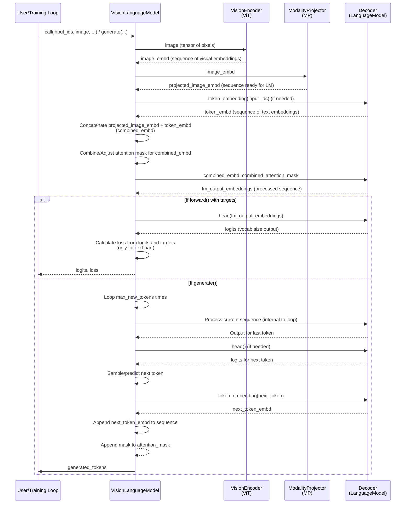

# 챕터 5: VisionLanguageModel (VLM)

nanoVLM 튜토리얼에 다시 오신 것을 환영합니다! 지난 몇 챕터에서 우리는 Vision-Language Model의 개별 구성 요소들을 살펴보았습니다:

*   [챕터 1: VLMConfig](01_vlmconfig_.md): 모델의 구조를 정의하는 청사진
*   [챕터 2: Vision Transformer (ViT)](02_vision_transformer__vit__.md): 입력 이미지를 수치적 embedding으로 처리하는 "눈"
*   [챕터 3: Modality Projector (MP)](03_modality_projector__mp__.md): 이미지 embedding을 언어 모델이 이해할 수 있는 형식으로 변환하는 "번역가"
*   [챕터 4: Language Model (LM)](04_language_model__lm__.md): embedding 시퀀스(시각적 embedding 포함)를 처리하고 텍스트 출력을 생성하는 "텍스트 두뇌"

이제 이 챕터에서는 이 모든 조각들을 하나로 모아보겠습니다! **`VisionLanguageModel` (VLM)** 클래스 자체를 살펴보겠습니다.

## 완전한 시스템: 시각과 언어의 조율

연극을 연출하는 것을 상상해보세요. 각자의 특정 역할을 가진 배우들(ViT, MP, LM)이 있습니다. **`VisionLanguageModel`**은 **연출가**입니다. 전체 장면(입력 이미지와 텍스트 프롬프트)을 받아서 각 배우에게 그들의 부분을 어떻게 처리할지 지시하고, 그들의 노력을 결합하여 최종 공연(생성된 텍스트)을 만들어냅니다.

`VisionLanguageModel`은 사용자가 직접 상호작용하여 다음과 같은 작업을 수행하는 클래스입니다:

*   **이미지에 대한 질문에 답하기:** ("이 그림에 무엇이 있나요?")
*   **이미지 설명하기:** ("이 장면을 설명해주세요.")
*   **이미지와 관련된 지시사항 따르기:** ("이미지를 바탕으로 캡션을 작성해주세요.")

이미지와 텍스트 입력을 받아 적절한 컴포넌트([ViT](02_vision_transformer__vit__.md), [MP](03_modality_projector__mp__.md), [LM](04_language_model__lm__.md))를 올바른 순서로 통과시켜 원하는 텍스트 출력을 생성합니다.

## VisionLanguageModel 사용하기

`VisionLanguageModel` 인스턴스를 일반적으로 어떻게 사용하는지 살펴보겠습니다. 가장 일반적인 작업은 텍스트 생성(답변 등)이나 forward pass 수행(학습 중 loss 계산에 사용)입니다.

### 모델 생성 또는 로드하기

[챕터 1: VLMConfig](01_vlmconfig_.md)에서 보았듯이, `VisionLanguageModel`을 생성하려면 `VLMConfig`가 필요합니다.

```python
# From models.vision_language_model or generate.py/train.py
from models.config import VLMConfig
from models.vision_language_model import VisionLanguageModel

# 기본 config 사용 또는 커스텀 config 로드/생성
model_config = VLMConfig() 

# config를 사용하여 모델 생성
# 이는 model_config를 기반으로 ViT, MP, LM을 초기화합니다
# load_backbone=True(VLMConfig의 기본값)이면 ViT와 LM의
# 사전학습된 가중치를 로드하려고 시도합니다.
model = VisionLanguageModel(model_config, load_backbone=model_config.vlm_load_backbone_weights)

# 모델을 디바이스로 이동(GPU 사용 가능시)
device = torch.device("cuda" if torch.cuda.is_available() else "cpu")
model.to(device)

print("VisionLanguageModel created and moved to device.")
```

또는, 종종 더 선호되는 방법으로, 이미 학습된 모델을 `from_pretrained` 메서드를 사용하여 로드할 수 있습니다. 이 메서드는 자동으로 설정과 저장된 가중치를 로드합니다.

```python
# From generate.py
from models.vision_language_model import VisionLanguageModel
import torch

# Hugging Face Hub 저장소에서 로드한다고 가정
source = "lusxvr/nanoVLM-222M" 
print(f"Loading weights from: {source}")

# 모델 인스턴스와 그 config와 가중치 로드
model = VisionLanguageModel.from_pretrained(source).to(torch.device("cuda" if torch.cuda.is_available() else "cpu"))

# 로드된 모델 객체는 config를 사용할 수 있음
print(f"Model loaded with config: {model.cfg.vit_model_type}, {model.cfg.lm_model_type}")
```

이 `from_pretrained` 메서드는 사용 준비가 된 모델을 로드하는 과정을 크게 단순화합니다.

### Forward Pass 수행하기 (학습 시 사용)

`forward` 메서드는 핵심 계산 단계입니다. 처리된 입력(이미지 텐서와 텍스트 토큰 ID)을 받아 모델의 출력(logits)과, 선택적으로 타겟 레이블이 제공된 경우 loss를 계산합니다. 이 메서드는 주로 학습 과정에서 사용됩니다([챕터 6: TrainConfig](06_trainconfig_.md)와 [챕터 7: Data Handling](07_data_handling__datasets__collators__processors__.md) 참조).

```python
# 학습 중 단순화된 사용법 (from train.py)
# batch, model, device가 준비되었다고 가정

# 데이터 배치 가져오기 (이미지, 토큰 ID, 레이블, attention mask 포함)
# ... (챕터 7에서 자세히 다룸) ...
images = batch["image"].to(device)
input_ids = batch["input_ids"].to(device) # 텍스트 토큰 ID
labels = batch["labels"].to(device)       # loss를 위한 타겟 토큰 ID
attention_mask = batch["attention_mask"].to(device) # 텍스트 토큰을 위한 mask

# forward pass 수행
# 모델은 이미지를 처리하고, input_ids와 결합하여
# logits를 출력하고 labels를 기반으로 loss를 계산합니다.
logits, loss = model(input_ids, images, attention_mask=attention_mask, targets=labels)

print(f"Forward pass completed. Loss: {loss.item():.4f}")
```

이는 `model(input_ids, images, ...)` 호출을 보여주며, 이는 내부적으로 `VisionLanguageModel` 클래스의 `forward` 메서드를 실행합니다.

### 텍스트 생성하기 (추론)

`generate` 메서드는 이미지와 초기 텍스트 프롬프트가 주어졌을 때 모델이 응답을 생성하도록 할 때 사용합니다. 이는 이미지 캡셔닝이나 VQA와 같은 작업을 위해 VLM을 사용할 때의 핵심입니다.

```python
# 추론 중 단순화된 사용법 (from generate.py)
# model, tokenizer, image_processor, device가 준비되었다고 가정

# 이미지 입력 준비
pil_image = Image.open("assets/image.png").convert("RGB")
image_tensor = image_processor(pil_image).unsqueeze(0).to(device) # 처리하고 배치 차원 추가

# 텍스트 입력 준비 (프롬프트)
prompt = "What is this object?"
template = f"Question: {prompt} Answer:" # 프롬프트 포맷
encoded = tokenizer.batch_encode_plus([template], return_tensors="pt")
input_ids = encoded["input_ids"].to(device) # 텍스트 토큰 ID
attention_mask = encoded["attention_mask"].to(device)

print("Input prompt:", prompt)

# 이미지와 프롬프트를 기반으로 새 토큰 생성
# model.generate는 한 번에 하나의 토큰을 예측하고
# 시퀀스에 추가하는 루프를 처리합니다.
generated_tokens = model.generate(input_ids, image_tensor, attention_mask=attention_mask, max_new_tokens=20)

# 생성된 토큰을 다시 텍스트로 디코딩
# [0]은 배치의 첫 번째(그리고 유일한) 항목을 선택
output_text = tokenizer.batch_decode(generated_tokens, skip_special_tokens=True)[0]

print("Generated text:", output_text)
```

여기서 핵심은 `model.generate(...)` 호출입니다. 이는 이미지와 초기 텍스트를 사용하여 다음 단어를 반복적으로 예측하고 최종 응답을 구축하는 과정을 조율합니다.

## 내부 작동 방식: VisionLanguageModel이 작동하는 방법

`VisionLanguageModel` 클래스는 주로 하위 모듈인 `vision_encoder` ([ViT](02_vision_transformer__vit__.md)), `MP` ([ModalityProjector](03_modality_projector__mp__.md)), `decoder` ([LanguageModel](04_language_model__lm__.md))의 컨테이너이자 조율자 역할을 하기 때문에 구조가 상당히 단순합니다.

데이터가 모델을 통과하는 흐름을, 특히 `forward` pass에서 추적해보겠습니다:



이 다이어그램은 `VisionLanguageModel`이 이미지를 `VisionEncoder` (ViT)로 라우팅한 다음 `ModalityProjector` (MP)로 전달하는 방법을 보여줍니다. 동시에, 텍스트 입력에 대한 embedding을 얻습니다(`Decoder`의 embedding 레이어 사용). 그런 다음 이러한 시각적 embedding과 텍스트 embedding을 단일 시퀀스로 결합하고, attention mask를 조정한 다음, 이 결합된 시퀀스를 `Decoder` (Language Model)에 전달하여 주요 처리 및 생성/예측 단계를 수행합니다.

`models/vision_language_model.py`의 간단한 코드 조각을 살펴보겠습니다.

### 초기화 (`__init__`)

생성자는 제공된 `VLMConfig`를 기반으로 세 가지 주요 컴포넌트 인스턴스를 생성합니다.

```python
# From models/vision_language_model.py
class VisionLanguageModel(nn.Module):
    def __init__(self, cfg: VLMConfig, load_backbone=True):
        super().__init__()
        self.cfg = cfg # config 저장

        if load_backbone:
            # 컴포넌트 생성, config에 지정된 경우 가중치 로드
            self.vision_encoder = ViT.from_pretrained(cfg)
            self.decoder = LanguageModel.from_pretrained(cfg)
        else:
            # 로드 없이 컴포넌트 생성 (예: 처음부터 학습하거나 전체 VLM 재개)
            self.vision_encoder = ViT(cfg)
            self.decoder = LanguageModel(cfg)
        
        # Modality Projector는 보통 처음부터 학습하므로 from_pretrained 없음
        self.MP = ModalityProjector(cfg)
        self.load_backbone = load_backbone # 명확성을 위해 플래그 저장
```

이는 `VLMConfig` (`cfg`)가 하위 모듈의 생성을 어떻게 지시하는지 보여줍니다. `load_backbone` 플래그는 [ViT](02_vision_transformer__vit__.md)와 [LM](04_language_model__lm__.md)에 대해 사전학습된 가중치를 로드할지 여부를 제어합니다.

### Forward Pass (`forward`)

`forward` 메서드는 다이어그램에 표시된 주요 데이터 흐름을 구현합니다.

```python
# From models/vision_language_model.py
class VisionLanguageModel(nn.Module):
    # ... __init__ 메서드 ...

    def forward(self, input_ids, image, attention_mask=None, targets=None):
        # 1. 이미지 처리
        image_embd = self.vision_encoder(image)
        image_embd = self.MP(image_embd) # 이미지 embedding 투영

        # 2. 텍스트 입력에 대한 embedding 얻기
        token_embd = self.decoder.token_embedding(input_ids)

        # 3. 이미지와 텍스트 embedding 결합
        combined_embd = torch.cat((image_embd, token_embd), dim=1) 
        
        # 4. 결합된 시퀀스에 대한 attention mask 조정
        if attention_mask is not None:
            batch_size = image_embd.size(0)
            img_seq_len = image_embd.size(1) # 투영된 이미지 토큰의 수
            # 이미지 토큰에 대한 mask 생성 (모두 1)
            image_attention_mask = torch.ones((batch_size, img_seq_len), device=attention_mask.device, dtype=attention_mask.dtype)
            # 이미지 mask와 텍스트 mask 연결
            attention_mask = torch.cat((image_attention_mask, attention_mask), dim=1)

        # 5. 결합된 시퀀스를 Language Model(decoder)에 통과
        # decoder는 전체 시퀀스를 처리하고 처리된 embedding을 출력(보통)
        lm_output_embeddings = self.decoder(combined_embd, attention_mask) 

        loss = None
        # 6. targets가 제공된 경우(학습 중) loss 계산
        if targets is not None:
            # LM의 head 레이어를 적용하여 logits(vocabulary 크기 예측) 얻기
            logits = self.decoder.head(lm_output_embeddings)
            # 텍스트 부분에 해당하는 logits만 고려
            # (다음 이미지 토큰이 아닌 다음 텍스트 토큰만 예측)
            logits = logits[:, image_embd.size(1):, :] 
            
            # 예측된 logits와 타겟 토큰 간의 Cross Entropy Loss 계산
            loss = F.cross_entropy(logits.reshape(-1, logits.size(-1)), targets.reshape(-1), ignore_index=-100)

        # logits(보통 head 이전의 처리된 LM embedding)와
        # loss(계산된 경우) 반환
        return lm_output_embeddings, loss # 참고: decoder의 embedding을 반환하며, 내부적으로 lm_use_tokens가 true가 아닌 한 최종 logits는 반환하지 않음. 하지만 loss 로직은 head를 명시적으로 적용함
```

이 메서드는 이미지 처리, 텍스트 embedding, 결합, attention mask 조정, 그리고 마지막으로 [Language Model](04_language_model__lm__.md)에 전달하는 순서를 명확하게 보여줍니다. 또한 텍스트 예측 부분에 대한 loss 계산도 처리합니다.

### 생성 (`generate`)

`generate` 메서드는 토큰을 반복적으로 예측해야 하므로 조금 더 복잡합니다. 또한 내부적으로 `decoder`의 `forward` 메서드를 사용합니다.

```python
# From models/vision_language_model.py
class VisionLanguageModel(nn.Module):
    # ... forward 메서드 ...

    @torch.no_grad() # 생성은 보통 그래디언트 추적 없이 수행
    def generate(self, input_ids, image, attention_mask=None, max_new_tokens=5):
        # 1. 이미지 처리 및 초기 텍스트 embedding과 결합 (forward의 시작과 동일)
        image_embd = self.vision_encoder(image)
        image_embd = self.MP(image_embd)
        token_embd = self.decoder.token_embedding(input_ids)
        combined_embd = torch.cat((image_embd, token_embd), dim=1)

        # 2. 초기 attention mask 조정
        batch_size = image_embd.size(0)
        img_seq_len = image_embd.size(1)
        if attention_mask is not None:
             image_attention_mask = torch.ones((batch_size, img_seq_len), device=attention_mask.device, dtype=attention_mask.dtype)
             attention_mask = torch.cat((image_attention_mask, attention_mask), dim=1)

        # 생성된 토큰을 저장할 텐서 준비
        generated_tokens = torch.zeros((batch_size, max_new_tokens), device=input_ids.device, dtype=input_ids.dtype)
        
        # 3. 생성 루프: max_new_tokens를 하나씩 예측
        outputs = combined_embd # 구축할 시퀀스
        for i in range(max_new_tokens):
            # 현재 시퀀스를 decoder에 통과
            model_out = self.decoder(outputs, attention_mask)
            
            # 시퀀스의 마지막 토큰에 대한 출력 얻기
            last_token_output = model_out[:, -1, :]
            
            # 다음 토큰에 대한 예측(logits)을 얻기 위해 LM의 head 레이어 적용
            # decoder가 내부적으로 embedding을 반환할 수 있으므로 필요
            if not self.decoder.lm_use_tokens: # LM 내부에서 head가 적용되는지 여부를 config 플래그로 확인
                last_token_logits = self.decoder.head(last_token_output)
            else:
                 last_token_logits = last_token_output # decoder가 이미 logits를 반환함

            # 예측된 다음 토큰 얻기 (예: 샘플링 또는 가장 확률이 높은 것 선택)
            probs = torch.softmax(last_token_logits, dim=-1)
            next_token = torch.multinomial(probs, num_samples=1) # 예시: 단순 샘플링

            # 예측된 토큰 저장
            generated_tokens[:, i] = next_token.squeeze(-1)
            
            # 4. 다음 반복을 위한 준비: 새 토큰을 시퀀스에 추가
            # 예측된 토큰을 다시 embedding으로 변환
            next_embd = self.decoder.token_embedding(next_token)
            # 새 embedding을 시퀀스에 추가
            outputs = torch.cat((outputs, next_embd), dim=1)

            # 새 토큰에 대한 '1'을 attention mask에 추가
            if attention_mask is not None:
                attention_mask = torch.cat((attention_mask, torch.ones((batch_size, 1), device=attention_mask.device)), dim=1)
        
        return generated_tokens # 예측된 토큰 ID의 텐서 반환
```

이 메서드는 텍스트 생성의 반복적 특성을 보여줍니다. 각 단계에서 모델은 현재 시퀀스(시각적 토큰 + 지금까지 생성된 텍스트 토큰)를 처리하고, *다음* 토큰을 예측하고, 그 embedding을 시퀀스에 추가하고, `max_new_tokens`가 생성될 때까지 반복합니다.

### 로딩과 저장 (`from_pretrained`, `save_pretrained`, `push_to_hub`)

`VisionLanguageModel` 클래스는 *전체* 모델(설정과 ViT, MP, LM의 모든 가중치 포함)을 쉽게 저장하고 로드하고 Hugging Face Hub에 푸시하는 메서드도 포함합니다. 이는 학습된 모델을 공유하고 배포하는 데 필수적입니다.

```python
# From models/vision_language_model.py (단순화됨)
class VisionLanguageModel(nn.Module):
    # ... forward와 generate 메서드 ...

    @classmethod # 이것은 클래스 메서드로, 클래스 자체에서 호출됨 (예: VisionLanguageModel.from_pretrained(...))
    def from_pretrained(cls, repo_id_or_path: str, *, revision: Optional[str] = None) -> "VisionLanguageModel":
        # HF Hub에서 config.json과 model.safetensors 다운로드 또는 로컬 경로에서 로드 처리
        # 먼저 config 로드
        # 개별적으로 backbone 가중치를 로드하지 않고 VLM 인스턴스 생성
        model = cls(cfg, load_backbone=False) 
        # 저장된 state_dict(ViT, MP, LM의 모든 레이어 포함)를 모델 인스턴스에 로드
        load_model(model, weights_path)
        return model

    def save_pretrained(self, save_directory: str) -> None:
        # 디렉토리 생성
        # config(self.cfg)를 config.json으로 저장
        # 모델의 state_dict(모든 가중치)를 model.safetensors로 저장
        save_model(self, os.path.join(save_directory, "model.safetensors"))

    def push_to_hub(self, repo_id: str, private: bool = False) -> None:
        # Hugging Face Hub 라이브러리 사용
        # Hub에 저장소 생성
        # save_pretrained를 사용하여 모델과 config를 임시 로컬 디렉토리에 저장
        # 임시 디렉토리의 내용을 Hub 저장소에 업로드
        pass # 단순화됨
```

이러한 메서드들은 체크포인트와 모델 배포의 복잡성을 캡슐화하여 `nanoVLM` 모델을 쉽게 관리할 수 있게 합니다.

## 결론

이 챕터에서 우리는 `VisionLanguageModel` 클래스가 [Vision Transformer (ViT)](02_vision_transformer__vit__.md), [Modality Projector (MP)](03_modality_projector__mp__.md), [Language Model (LM)](04_language_model__lm__.md)을 함께 모아 완전한 멀티모달 시스템을 형성하는 중앙 조율자 역할을 하는 것을 보았습니다. VLM 인스턴스를 생성하거나 로드하는 방법과 `forward`와 `generate` 메서드가 학습과 추론에 어떻게 사용되는지 배웠습니다. 또한 `forward` 메서드 내부를 살펴보아 이미지와 텍스트 입력이 컴포넌트를 통해 최종 출력이나 loss 계산으로 이어지는 데이터 흐름을 이해했고, 편리한 `from_pretrained`와 `save_pretrained` 메서드도 살펴보았습니다.

이제 VLM의 아키텍처와 사용 방법을 이해했으니, 다음 단계는 효과적으로 학습시키는 방법을 이해하는 것입니다. 이를 위해서는 또 다른 설정 객체인 `TrainConfig`가 필요합니다.

[다음 챕터: TrainConfig](06_trainconfig_.md)